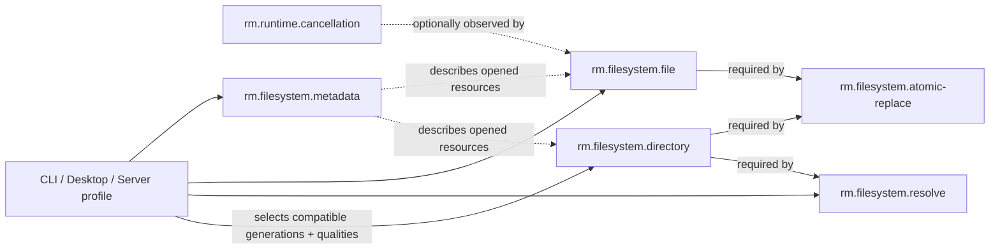

# Filesystem dependency and profile composition

**Status:** Reviewed domain composition  
**Scope:** Filesystem foundations 0.1.1

The solid capability arrows above correspond to reviewed graph edges, with graph direction expressed as consumer to dependency: resolve requires directory; atomic replacement requires directory and file. Dotted metadata arrows describe subject relationships, not minimum capability dependencies, and therefore do not enter the source-linked graph.

| Relationship | Type | Required boundary |
|---|---|---|
| `rm.filesystem.resolve` → `rm.filesystem.directory` | required capability edge | compatible generations; caller supplies explicit directory authority |
| `rm.filesystem.atomic-replace` → directory and file | required capability edges | compatible generations; namespace authority and prepared file remain distinct |
| `rm.filesystem.file` → `rm.runtime.cancellation` | optional capability edge | only async operations that accept cancellation observe the shared terminal-outcome contract |
| metadata → directory/file/link subject | semantic subject relationship | subject and race semantics are explicit; no ownership or minimum dependency is inferred |
| durability → file/directory/replacement | quality composition | selected D-level binds exact content, metadata, namespace, device, or remote boundary |

The [CLI profile](../profiles/foundation-cli.md) requires directory, resolve, file, and metadata generations `>=0.1.0,<0.2.0`, with R1-or-stronger resolution and sync-complete file I/O. The [desktop profile](../profiles/foundation-desktop.md) adds atomic replacement; the [server profile](../profiles/foundation-server.md) requires it only when mutable local state is persisted. Embedded/headless use remains optional and must state its filesystem and durability frontier.

**RM-FILESYSTEM-DEPENDENCY-0001:** A selecting profile MUST resolve compatible directory, resolution, file, metadata, cancellation-if-used, atomic-replacement-if-used, R-level, and D-level constraints.

**RM-FILESYSTEM-DEPENDENCY-0002:** Directory authority MUST flow into resolution and namespace mutation explicitly; a path string, process current directory, metadata snapshot, or prior canonicalization MUST NOT substitute for it.

**RM-FILESYSTEM-DEPENDENCY-0003:** Required capability edges, optional use, quality composition, semantic subjects, and profile membership MUST remain distinct graph concepts.

**RM-FILESYSTEM-DEPENDENCY-0004:** Profile satisfaction MUST NOT imply support for every filesystem family, metadata field, traversal policy, atomic-replacement policy, or durability level.
