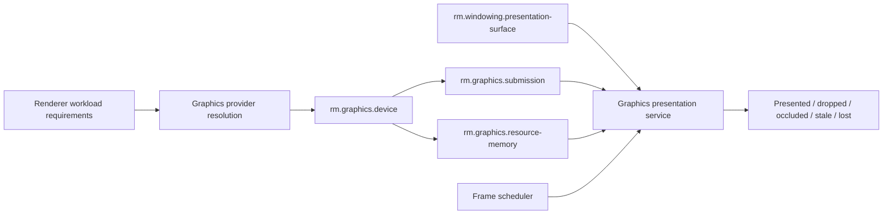

# Graphics and presentation vertical slice

| Field | Value |
|---|---|
| Status | Draft domain analysis |
| Purpose | Define device discovery, workload negotiation, resource lifetime, submission, synchronization, and window presentation without standardizing a speculative universal renderer |

## Domain boundary

Graphics owns device and queue lifecycles, resource memory, synchronization, presentation-image acquisition, frame submission, timing, and loss recovery. Windowing owns the native window and surface generation. Renderers own scene/text/domain semantics and produce work for an exact negotiated graphics contract.

This slice deliberately does not select a shading language, command encoding API, render graph, 2D scene model, text rasterizer, image codec, or crate boundary. Those require at least two concrete renderer workloads and an RFC.

## Architectural conclusions

- A graphics provider is selected by a versioned workload/feature vector, not by the label “GPU accelerated” or an OS/API name.
- Presentation is a service composition over a window surface, device, queue, synchronization, and frame policy.
- Frame acquisition is bounded and may wait, time out, become unavailable, or be invalidated.
- Submission completion, presentation acceptance, and actual visibility are distinct milestones.
- Device loss and surface-generation change invalidate scoped objects through explicit epochs/generations.
- Software rendering is a distinct provider with declared quality—not a silent fallback.

## Documents

- [`rm.graphics.device`](device.md)
- [`rm.graphics.resource-memory`](resource-memory.md)
- [`rm.graphics.submission`](submission.md)
- [Graphics presentation service](presentation-service.md)
- [Frame scheduling and timing](frame-scheduling.md)
- [Platform research](platform-research.md)
- [Conformance specification](conformance.md)
- [Benchmark specification](benchmarks.md)

