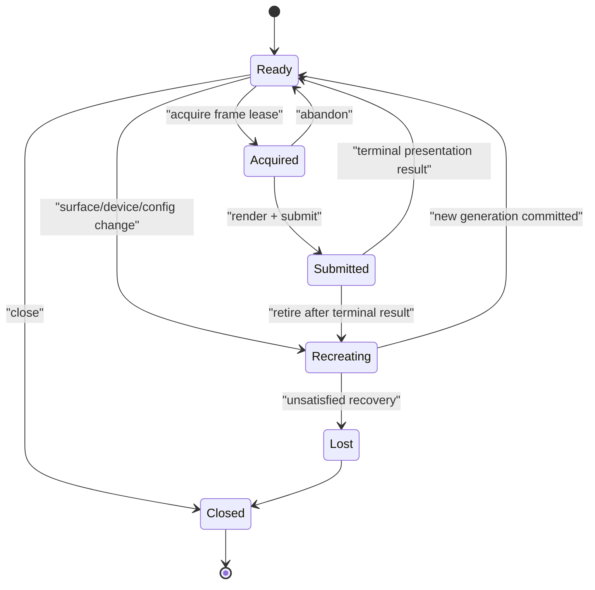

# Graphics presentation service

| Field | Value |
|---|---|
| Status | Draft platform service 0.1.0 |

The service composes a compatible graphics device/queue with one [`rm.windowing.presentation-surface`](../windowing/presentation-surface.md). It owns presentation images, frame leases, synchronization, pacing policy, and recovery; it does not own the window or renderer state.

**RM-GRAPHICS-PRESENT-0001:** Session creation binds one window surface generation, one device epoch, selected format/color/alpha mode, image count, present modes, timing quality, frame-flight limit, and degradation report atomically.

**RM-GRAPHICS-PRESENT-0002:** Frame acquisition returns a single-use lease containing image/resource identity, extent, format/color state, acquire dependency, session generation, frame ID, and deadline/timing hint. It may become ready, time out, cancel before lease, become occluded/unavailable, or require recreation.

**RM-GRAPHICS-PRESENT-0003:** A frame lease is submitted at most once or abandoned explicitly. Dropping/abandoning it releases provider ownership without presenting undefined content.

**RM-GRAPHICS-PRESENT-0004:** Present requires rendering completion dependencies, damage where supported, desired timing/mode, and the exact surface/session generation. Stale generations fail before a visibility claim.

**RM-GRAPHICS-PRESENT-0005:** `submitted`, `accepted_for_presentation`, `displayed`, `replaced/dropped`, and `unknown` are distinct results. Providers advertise which milestones are observable and their timestamp quality.

**RM-GRAPHICS-PRESENT-0006:** Occlusion/minimization may suspend acquisition or lower pacing. The service preserves bounded memory/latency and produces an explicit resume/recreate outcome; it never busy-spins on unavailable presentation.

**RM-GRAPHICS-PRESENT-0007:** Resize, scale/color change, window surface invalidation, out-of-date/suboptimal state, device loss, display migration, and suspend/resume trigger an explicit drain/retire/recreate transition. The renderer retains semantic state and redraws; old image contents are not assumed preserved.

**RM-GRAPHICS-PRESENT-0008:** Reconfiguration commits a new presentation-session generation. Old frame leases may complete only under their declared retirement policy and cannot be presented as the new generation.

**RM-GRAPHICS-PRESENT-0009:** Frame-latency policy bounds queued work and distinguishes throughput, balanced, low-latency, power-saving, and externally paced intents. Tearing/variable-refresh behavior requires explicit support and policy permission.

**RM-GRAPHICS-PRESENT-0010:** Color encoding, transfer function, primaries, luminance metadata, alpha/composition, tone mapping, and OS compositor conversion are declared. `HDR` is not a boolean quality claim.

**RM-GRAPHICS-PRESENT-0011:** Partial damage is an optimization only; the final visible result must equal full-frame rendering under the same preservation contract. Providers disclose when damage is ignored.

**RM-GRAPHICS-PRESENT-0012:** Protected presentation/capture exclusion is separately negotiated end-to-end across window, graphics, compositor, and output. Any unproven link prevents a confidentiality claim.

