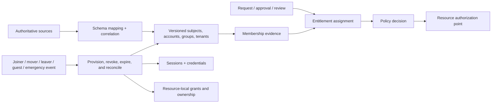

# Account, directory, tenant, and identity-governance foundations

| Field | Value |
|---|---|
| Status | Draft domain analysis |
| Purpose | Model identity records and governance workflows without confusing directory evidence, group membership, entitlements, sessions, credentials, or effective authority |

## Conclusions

- Stable Rusty Mill subject and object identities use immutable generations; names, email addresses, login names, and provider identifiers are aliases or source keys, not universal identity.
- Directory facts and group membership are provenance-bearing evidence. They do not themselves grant an entitlement or authorize a resource operation.
- Provisioning is convergent reconciliation between desired and observed state, with explicit mapping loss, concurrency, partial failure, and deprovisioning residuals.
- Joiner, mover, leaver, guest, federation, access-review, privileged, and emergency workflows are stateful cases with deadlines, approvals, effects, reversals, and evidence.
- Disabling an account is not complete deprovisioning; sessions, credentials, tokens, groups, entitlements, resource-local grants, ownership, queues, replicas, and downstream providers must be reconciled.

## Documents

- [Model and identity generations](model.md)
- [Directory objects, aliases, and correlation](directory-objects.md)
- [Tenants, invitations, guests, and federation](tenants-federation.md)
- [Groups and membership](groups-membership.md)
- [Queries, snapshots, and change streams](queries-change-streams.md)
- [Schemas and provider mappings](schemas-mappings.md)
- [Provisioning and reconciliation](provisioning-reconciliation.md)
- [Account lifecycle and joiner-mover-leaver](account-lifecycle.md)
- [Entitlement requests, approvals, and reviews](entitlements-reviews.md)
- [Privileged and emergency access](privileged-emergency.md)
- [Deprovisioning and residual ownership](deprovisioning.md)
- [Platform and standards research](platform-research.md)
- [Cross-cutting qualities](cross-cutting.md)
- [Conformance](conformance.md)
- [Benchmarks](benchmarks.md)

## Decisions

- [ADR-0126: Directory membership is evidence, not effective authority](../../adr/0126-directory-membership-is-evidence-not-effective-authority.md)
- [ADR-0127: Deprovisioning is multi-boundary reconciliation, not account disablement](../../adr/0127-deprovisioning-is-multi-boundary-reconciliation.md)

## Boundary

This domain does not choose an identity provider, HR source, directory product, tenant model, authorization language, authenticator, legal employment process, or organizational approval policy. Products bind those choices through profiles, RFCs, and policy generations.
