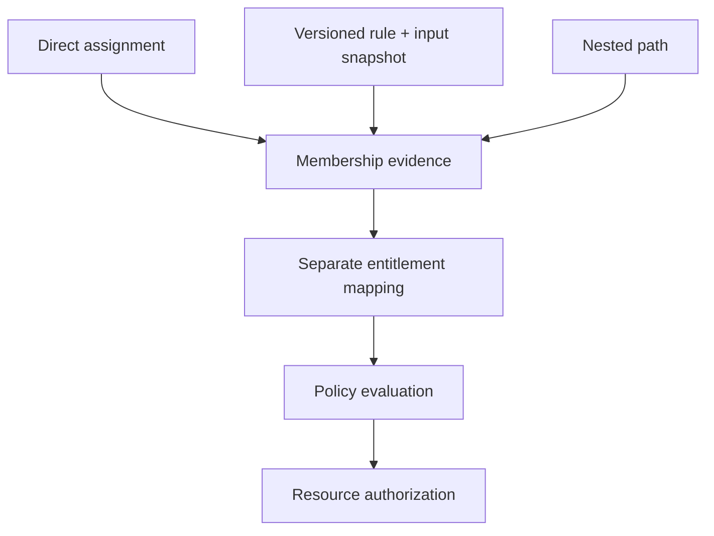

# Groups and membership

**RM-IDENTITY-GOV-GROUP-0001:** Group identity, generation, owner, purpose, membership mode, rule generation, nesting policy, review cadence, expiry, and lifecycle state are explicit.

**RM-IDENTITY-GOV-GROUP-0002:** Membership evidence distinguishes direct, dynamic, nested, external, temporary, and exception sources and records the complete derivation path and input revisions.

**RM-IDENTITY-GOV-GROUP-0003:** Dynamic evaluation is bounded, deterministic for a named input snapshot, and exposes unknown attributes and stale inputs. It does not silently treat unknown as false for security-relevant membership.

**RM-IDENTITY-GOV-GROUP-0004:** Nested traversal detects cycles, depth and fan-out limits, tenant crossings, excluded members, and conflicting provider semantics. Partial traversal cannot produce an unqualified complete set.

**RM-IDENTITY-GOV-GROUP-0005:** Membership changes invalidate dependent entitlement and authorization caches by generation; propagation is measured and never inferred from directory write success.
