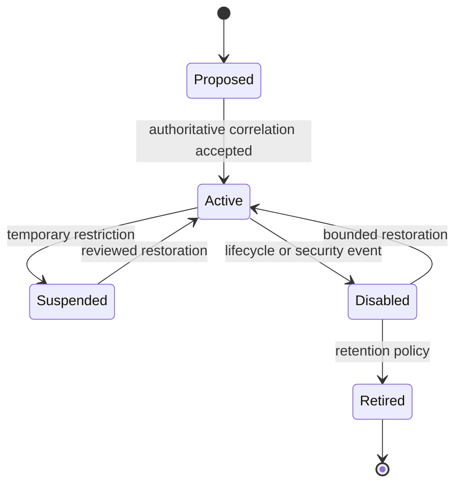

# Model and identity generations

**RM-IDENTITY-GOV-MODEL-0001:** A `SubjectRef` binds a Rusty Mill subject identifier and immutable generation; an `AccountRef` additionally binds tenant, provider, provider-native identifier, account kind, and generation.

**RM-IDENTITY-GOV-MODEL-0002:** Person, workload, service, device, agent, group, account, tenant, credential, session, entitlement, assignment, and resource ownership are distinct typed entities. Implementations do not reuse an identifier across kinds.

**RM-IDENTITY-GOV-MODEL-0003:** Mutable names, addresses, usernames, employee numbers, and provider keys are versioned aliases with issuer, namespace, validity, confidence, and privacy classification. An alias alone never proves subject equality.

**RM-IDENTITY-GOV-MODEL-0004:** Merge links preserve both predecessor identities, provenance, conflicts, reversibility limits, and downstream effects. Split creates new generations and requires re-evaluation; it never copies authority implicitly.

**RM-IDENTITY-GOV-MODEL-0005:** Every observation records source, source revision or cursor, observed time, effective time when known, schema/mapping generation, trust scope, completeness, and freshness.

**RM-IDENTITY-GOV-MODEL-0006:** Lifecycle states describe evidence, not successful downstream effect. Each requested transition emits separately scoped accepted, applied, propagated, verified, failed, and residual milestones.
