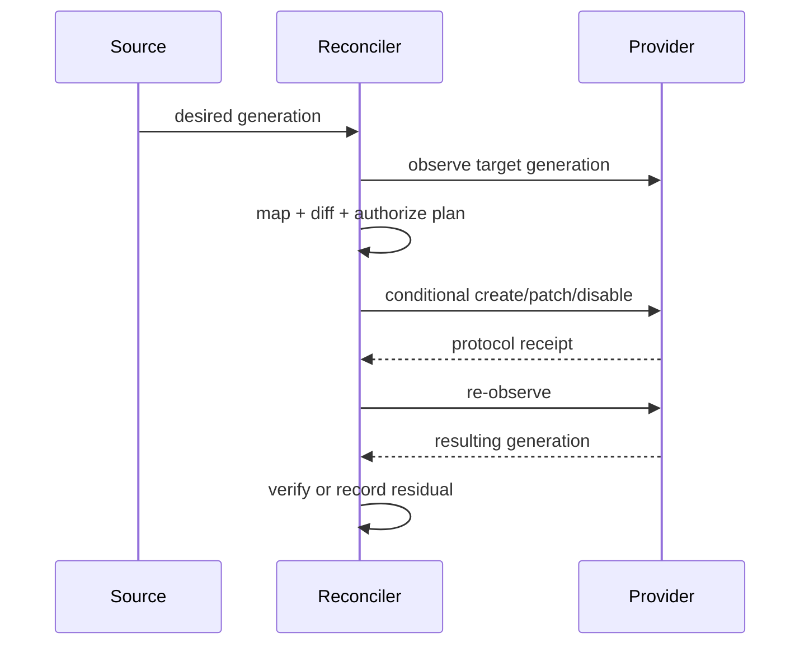

# Provisioning and reconciliation

**RM-IDENTITY-GOV-PROVISION-0001:** A provisioning plan binds desired and observed generations, mapping/policy/provider capabilities, ordered operations, preconditions, authority, deadlines, retry/idempotency rules, and rollback or compensation limits.

**RM-IDENTITY-GOV-PROVISION-0002:** Create, replace, patch, membership, disable, delete, restore, and credential operations have distinct idempotency and concurrency semantics. Retries never broaden target or authority.

**RM-IDENTITY-GOV-PROVISION-0003:** Bulk operations retain per-object and per-operation outcomes; a batch receipt cannot mask partial success, skipped dependencies, stale writes, or ambiguous effects.

**RM-IDENTITY-GOV-PROVISION-0004:** Reconciliation classifies drift as expected, pending, conflicting, unauthorized, unmanaged, orphaned, provider-limited, or unknown and applies a product-selected repair or escalation policy.

**RM-IDENTITY-GOV-PROVISION-0005:** Connectors hold least authority, isolate tenants, protect credentials, bound queues and backoff, expose throttling, and redact payloads while retaining correlation evidence.
