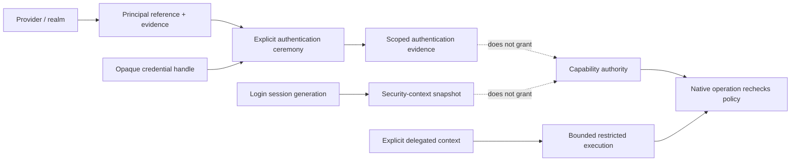

# Credential and identity-session foundations vertical slice

| Field | Value |
|---|---|
| Status | Draft domain analysis |
| Purpose | Observe local principals and login sessions, obtain scoped authentication evidence, and execute narrowly delegated work without turning identity or credentials into ambient authority |

## Conclusions

- Principal identity, login session, authentication evidence, credential material, security context, authorization advice, and capability authority are different entities.
- Account names, display names, email addresses, numeric user identifiers, group lists, and native tokens are provider-scoped evidence, not universal identity.
- Authentication is an explicit purpose- and audience-bound ceremony. Its result is expiring evidence, never a reusable password or automatic authorization.
- A session/context snapshot is generation-scoped and may become stale after lock, logoff, fast-user switching, policy change, privilege change, or provider restart.
- Impersonation and delegation run only inside a narrow restricted-operation boundary. Ambient thread credentials never flow implicitly through an async task.
- Remote federation, account provisioning/recovery, password management, directory synchronization, and application-specific sign-in protocols remain separate services.

## Documents

- [Principal identity and evidence](principal-identity.md)
- [Authentication ceremonies](authentication-ceremony.md)
- [Login sessions and security contexts](session-context.md)
- [Credential handles and brokers](credential-handles.md)
- [Impersonation and delegation](impersonation-delegation.md)
- [Change, expiry, and revocation](change-revocation.md)
- [Security, privacy, and accessibility](security-accessibility.md)
- [Platform research](platform-research.md)
- [Conformance](conformance.md)
- [Benchmarks](benchmarks.md)
