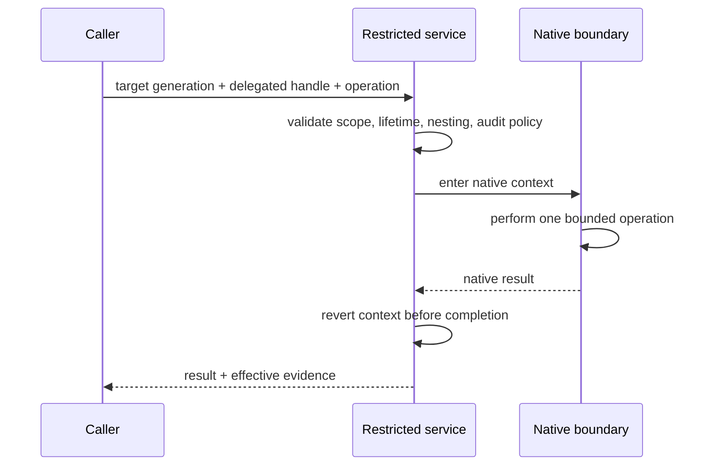

# Impersonation and delegation

Impersonation temporarily changes which native security context an operation presents. Delegation conveys attenuated ability to act for another principal. Neither is ordinary ambient task state.

**RM-IDENTITY-DELEGATE-0001:** Delegated execution MUST bind delegator/delegate evidence, target operation/resource scope, audience, constraints, maximum lifetime/use count, propagation policy, and revocation/close behavior.

**RM-IDENTITY-DELEGATE-0002:** The provider MUST attenuate or reject a request; it MUST NOT synthesize broader rights than the source context possesses.

**RM-IDENTITY-IMPERSONATE-0001:** Native impersonation occurs only within a restricted synchronous boundary that guarantees context restoration on success, error, panic, cancellation request, and callback failure.

**RM-IDENTITY-IMPERSONATE-0002:** Impersonation MUST NOT flow implicitly across `await`, executor scheduling, thread-pool reuse, user callbacks, plugin calls, logging/export, or unrelated I/O. Async callers submit a bounded operation to a dedicated service and await its result.

**RM-IDENTITY-IMPERSONATE-0003:** Nesting is prohibited unless a provider proves stack discipline, exact restoration, maximum depth, and failure behavior. Unknown current context fails closed.

**RM-IDENTITY-IMPERSONATE-0004:** Audit evidence records purpose, principal/context references, requested/effective scope, operation class, timing, and outcome without credentials or sensitive target data.

**RM-IDENTITY-IMPERSONATE-0005:** A delegated/impersonated native context is not exported as general Rust execution authority. Long-lived worker identity, privilege separation, and sandboxing use restricted-execution/process services.

See [ADR-0063](../../adr/0063-impersonation-is-a-restricted-operation-boundary.md).
