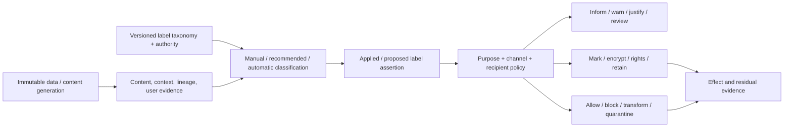

# Data classification, sensitivity labeling, information-protection, and loss-prevention foundations

| Field | Value |
|---|---|
| Status | Draft domain analysis |
| Purpose | Carry versioned classification assertions into explicit protection and channel-enforcement decisions without conflating labels, detected content, encryption, rights, or completed effects |

## Conclusions

- A label is a versioned issuer-scoped assertion over a subject generation; it is not intrinsic sensitivity, encryption, access authority, or proof that protection was applied.
- Manual, default, inherited, recommended, and automatic classifications retain distinct provenance, confidence, review, freshness, and override semantics.
- Downgrade, declassification, removal, and cross-taxonomy mapping are authority-bearing transitions with justification and policy evidence.
- Loss-prevention enforcement binds exact content/label/context/recipient/channel generations and reports user mediation separately from the eventual channel effect.
- Marking, encryption, rights management, retention, redaction, tokenization, transformation, and blocking are independent protection effects with their own completion and recovery evidence.

## Documents

- [Model, entities, and milestones](model.md)
- [Taxonomies, labels, and authority](taxonomy-labels.md)
- [Classification evidence and inference](classification.md)
- [Inheritance, aggregation, and lineage](inheritance-lineage.md)
- [Downgrade, declassification, and review](downgrade-review.md)
- [Marking, encryption, and rights protection](protection-effects.md)
- [Loss-prevention channels and enforcement](dlp-enforcement.md)
- [User mediation, policy tips, and justification](user-mediation.md)
- [Sharing, tenants, and external recipients](sharing-tenants.md)
- [Offline, freshness, revocation, and reconciliation](lifecycle.md)
- [Audit, privacy, and governance](audit-governance.md)
- [Platform research](platform-research.md)
- [Cross-cutting qualities](cross-cutting.md)
- [Conformance](conformance.md)
- [Benchmarks](benchmarks.md)

## Decisions

- [ADR-0122: Sensitivity labels are scoped assertions, not protection or authority](../../adr/0122-sensitivity-labels-are-scoped-assertions-not-protection-or-authority.md)
- [ADR-0123: Downgrade and declassification are authorized transitions](../../adr/0123-downgrade-and-declassification-are-authorized-transitions.md)

## Boundary

This domain composes content inspection, schemas, lineage, identity, authorization, policy, cryptography, rights services, storage, transfer, networking, printing, capture, observability, and user interaction. It does not choose organizational taxonomies, legal classifications, sensitive-information definitions, classifier models, encryption templates, rights services, DLP rules/channels, retention, overrides, incident workflow, or jurisdictional meaning.
