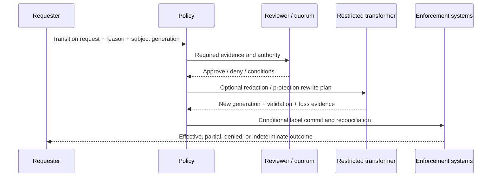

# Downgrade, declassification, and review

**RM-PROTECTION-DOWNGRADE-0001:** A transition plan binds subject generation, current assertions/protections, target label/state, governing taxonomy/policy, evidence and lineage, requested reason, requester authority, approval/quorum, required transformation/validation, and downstream effects.

**RM-PROTECTION-DOWNGRADE-0002:** Downgrade, declassification, label removal, protection removal, recipient broadening, expiry extension, and mapping to a weaker foreign taxonomy are distinct operations and require explicit policy authority.

**RM-PROTECTION-DOWNGRADE-0003:** Free-text justification is untrusted evidence, not authorization. Products use localized structured reason codes, bounded optional text, reviewer context, privacy/redaction, and anti-coercion/accessibility design.

**RM-PROTECTION-DOWNGRADE-0004:** Required content transformation is completed and independently validated before a lower assertion is committed. A failed/partial redaction or sanitization retains the prior effective handling policy.

**RM-PROTECTION-DOWNGRADE-0005:** Transition commit conditionally updates authoritative label metadata and separately reconciles encryption/rights, markings, indexes, caches, copies, links, shares, retention, search, DLP, and audit. Partial propagation is explicit.

**RM-PROTECTION-DOWNGRADE-0006:** Emergency/break-glass transitions bind incident, duration, scope, approver, notification, enhanced audit, recipient/channel restrictions, expiry, and post-event review; they do not become reusable normal policy.

**RM-PROTECTION-DOWNGRADE-0007:** Appeal and false-positive review preserve original evidence, permit corrected classifier outcomes, track reviewer conflicts, and prevent repeated blocked attempts from bypassing policy through alternate channels.

