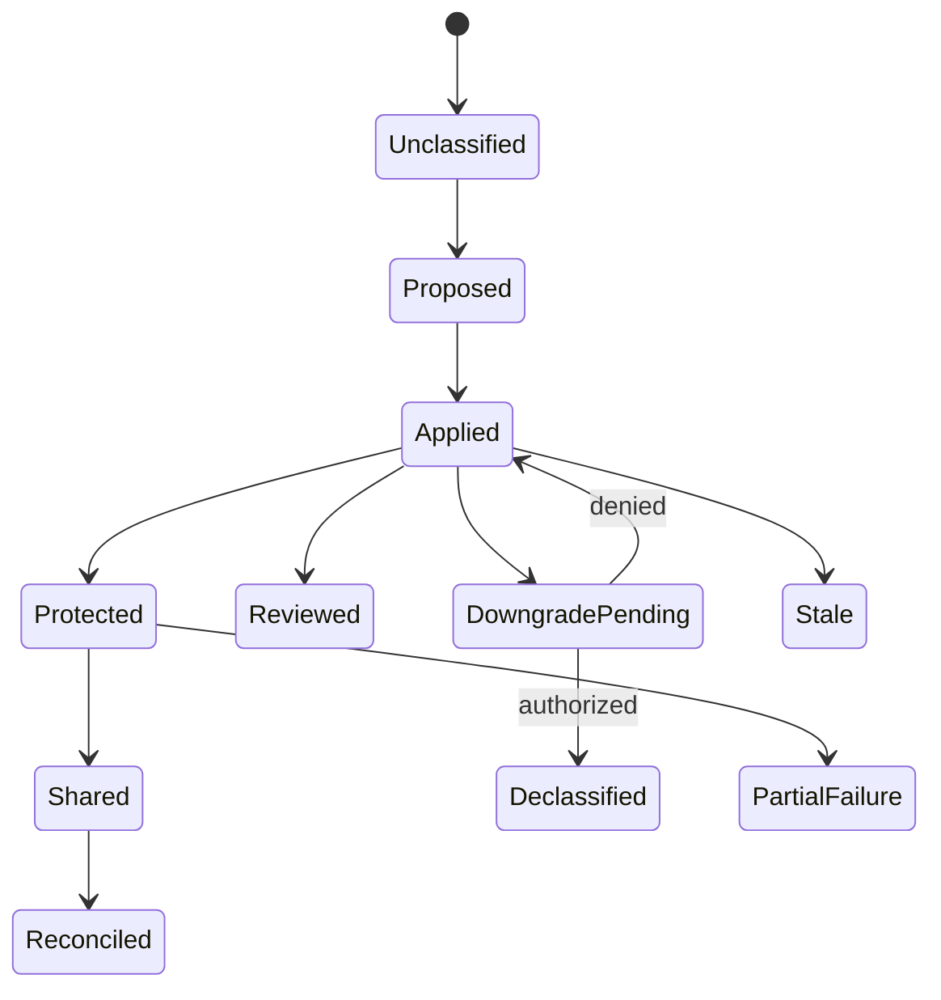

# Model, entities, and milestones

**RM-PROTECTION-MODEL-0001:** A protected subject binds immutable data/content generation, owner/controller/tenant, schema/media/structure, lineage, storage and usage context, current label assertions, embedded markings/protection, and authoritative source.

**RM-PROTECTION-MODEL-0002:** A label assertion binds taxonomy/label/revision, issuer and applying principal/service, assignment method, subject generation and scope, evidence/classifier/policy generations, confidence/review state, time/expiry, justification, and signature/integrity where selected.

**RM-PROTECTION-MODEL-0003:** Classification proposed, label applied, metadata persisted, marking rendered, encryption completed, rights published, channel evaluated, user warned/justified, transfer blocked/allowed, recipient received, downstream protection observed, and revocation reconciled are distinct milestones.

**RM-PROTECTION-MODEL-0004:** Results distinguish applicable/not-applicable, labeled/unlabeled/conflicting/unrecognized, recommended/required, allow/warn/justify/block/transform/quarantine/review, protected/unprotected/partially protected, stale/offline/unknown, unsupported, failed, cancelled, and effect-indeterminate.

**RM-PROTECTION-MODEL-0005:** Decisions bind subject, label/taxonomy, content evidence, principal/device/application, action/purpose, source/destination/channel/recipient, location/network/time, policy/provider generations, obligations, limits, and current authority.

**RM-PROTECTION-MODEL-0006:** Assertions and decisions enumerate nonclaims: a label does not prove sensitive content, completeness, current authorization, encryption, recipient behavior, deletion, retention, or prevention of alternate capture.

