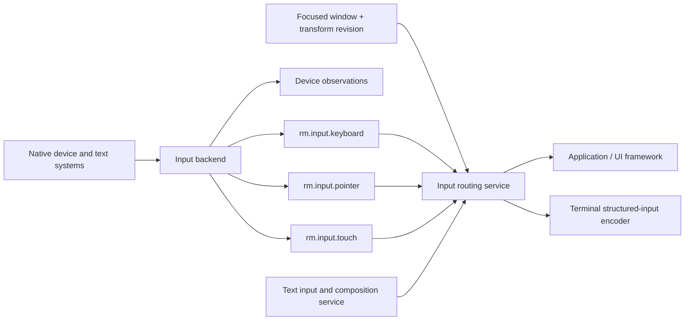

# Input foundations vertical slice

| Field | Value |
|---|---|
| Status | Draft domain analysis |
| Purpose | Define trusted provenance, focus-routed keyboard/pointer/touch observations, and text composition without equating keys with text or events with authority |

## Domain boundary

The input domain observes native input and routes it under window focus/capture policy. It preserves physical control identity, logical meaning, text commits, composition, location, timing, device class, and provenance as separate facts. It does not decide application commands, widget focus traversal, shortcuts, text editing, terminal escape encodings, or permissions merely because an event occurred.

## Architectural conclusions

- Key events and text input are independent streams with causal association where the platform provides it.
- Raw/device-specific, normalized physical, logical, and semantic-command layers remain distinguishable.
- Native focus and capture constrain delivery; application focus is higher-layer state.
- Genuine, accessibility-generated, remote, replayed, and synthetic events have explicit provenance and assurance.
- Pointer motion/scroll may coalesce with disclosed coverage; transitions and text commits may not disappear silently.
- Secure input reduces observation/exposure but cannot prove secrecy from the target application or OS.

## Documents

- [`rm.input.keyboard`](keyboard.md)
- [`rm.input.pointer`](pointer.md)
- [`rm.input.touch`](touch.md)
- [Text input and composition service](text-input-service.md)
- [Routing, focus, capture, and provenance](routing-provenance.md)
- [Platform research](platform-research.md)
- [Conformance specification](conformance.md)
- [Benchmark specification](benchmarks.md)

