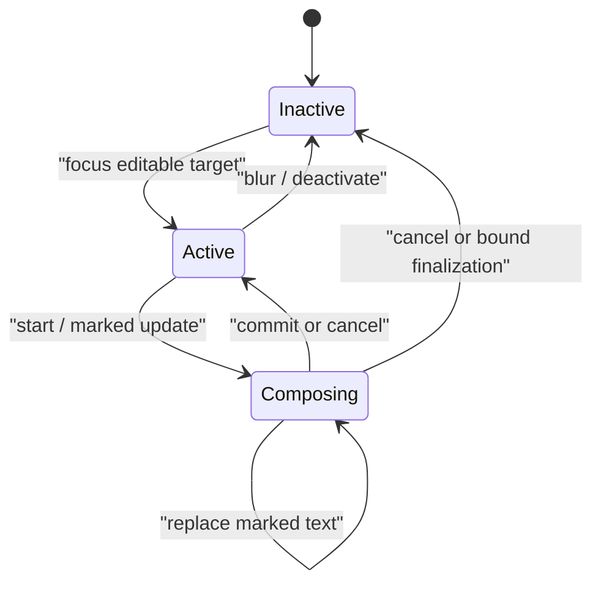

# Text input and composition service

| Field | Value |
|---|---|
| Status | Draft platform service 0.1.0 |

This service joins a focused editable target with the native text-input system. It is separate from keyboard observation because committed text may come from IMEs, voice, handwriting, accessibility, software keyboards, paste, or other services without a one-to-one key event.

**RM-INPUT-TEXT-0001:** Activation supplies editable purpose/scope, content type/sensitivity, language hints, multiline/autocorrect/capitalization policy, surrounding-text disclosure policy, selection/composition revision, caret/selection geometry, window transform revision, and target identity.

**RM-INPUT-TEXT-0002:** Events distinguish composition start, replace/update marked text, selection within composition, commit text, delete-surrounding request, composition cancel/end, and input-panel/candidate geometry changes.

**RM-INPUT-TEXT-0003:** Preedit/marked text is provisional and never emitted as committed application text. A commit replaces the declared target range exactly once under one document revision or is rejected/reconciled explicitly.

**RM-INPUT-TEXT-0004:** Text and indices identify Unicode encoding/unit and normalization policy. Native UTF-16/code-point/byte offsets are converted with checked revision-bound mappings; rounding into a scalar or grapheme is prohibited.

**RM-INPUT-TEXT-0005:** Surrounding text and selection are shared only to the minimum declared range. Password/secret fields default to no surrounding-text disclosure, learning, prediction, dictation recording, or application logging where platform support permits.

**RM-INPUT-TEXT-0006:** Candidate/preedit placement consumes current caret geometry and transform revision. Stale geometry is updated or disclosed; it is not silently interpreted in a new coordinate space.

**RM-INPUT-TEXT-0007:** Focus/target changes cancel or transfer composition only under explicit native semantics. A commit arriving during focus transition is delivered to the causally bound target or rejected; it never lands in the newly focused target by timing accident.

**RM-INPUT-TEXT-0008:** Keyboard events consumed by text services remain classified as consumed where observable. Applications do not generate duplicate text by independently mapping those keys.

**RM-INPUT-TEXT-0009:** Sync native callbacks that require immediate document answers use a bounded provider-maintained snapshot; arbitrary application code is not called reentrantly. Mutations are delivered through the ordered service stream.

**RM-INPUT-TEXT-0010:** Deactivation, cancellation, overflow, target destruction, and service failure define final composition disposition and close event delivery exactly once.

**RM-INPUT-TEXT-0011:** Accessibility technologies and alternate input methods participate through native text semantics, not fabricated keyboard events, and receive accurate caret/selection/composition geometry.

**RM-INPUT-TEXT-0012:** Secure-input mode is a scoped best-effort protection vector with platform evidence; it never claims the OS, IME, target application, or hardware cannot observe entered content.

