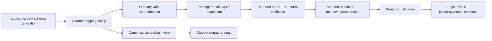

# Structured data interchange and serialization foundations

| Field | Value |
|---|---|
| Status | Draft domain analysis |
| Purpose | Exchange bounded typed values through versioned schemas and explicit wire or canonical views without confusing representation equality with semantic equality |

## Conclusions

- Logical values, schemas, ordinary encodings, canonical views, framed messages, and decoded host objects have distinct identities.
- Deterministic serialization is not automatically canonical; signing and hashing bind a named immutable canonicalization profile and schema context.
- Well-formed decoding, schema compatibility, semantic validity, provenance, safety, and authorization are separate milestones.
- Unknown fields and variants are version-skew evidence whose preservation and forwarding authority are explicit.
- Transcoding reports semantic and representation loss rather than claiming universal round trips.

## Documents

- [Model, entities, and milestones](model.md)
- [Logical data model and schema identity](logical-schema.md)
- [Schema evolution and resolution](evolution-resolution.md)
- [Wire encodings and format mappings](wire-formats.md)
- [Canonicalization and signed views](canonicalization.md)
- [Framing, streaming, and negotiation](framing-negotiation.md)
- [Parsing, validation, and hostile input](parsing-validation.md)
- [Unknown fields, unions, and extensions](unknown-unions-extensions.md)
- [Lazy, borrowed, and zero-copy decoding](lazy-zero-copy.md)
- [Transcoding and loss accounting](transcoding.md)
- [Registries and lifecycle](registries-lifecycle.md)
- [Cross-cutting qualities](cross-cutting.md)
- [Platform and standards research](platform-research.md)
- [Conformance vectors](conformance.md)
- [Benchmarks](benchmarks.md)

## Decisions

- [ADR-0112: Logical schema identity is distinct from wire encoding](../../adr/0112-logical-schema-identity-is-distinct-from-wire-encoding.md)
- [ADR-0113: Canonicalization is an explicit signed-view profile](../../adr/0113-canonicalization-is-an-explicit-signed-view-profile.md)

## Boundary

This domain does not choose product messages, API IDLs, storage schemas, cryptographic algorithms, media types, protocol envelopes, schema-registry products, or implementation crates. Products select logical schemas, formats/mappings, canonical profiles, compatibility, registries, negotiation, validation, limits, and lifecycle through RFCs.
