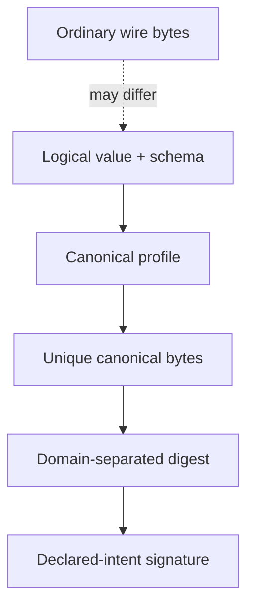

# Canonicalization and signed views

**RM-INTERCHANGE-CANON-0001:** A canonical profile binds logical schema and value semantics, exact format/standard/version, field inclusion/exclusion, mapping, ordering, numeric/text/time normalization, duplicate/unknown/extension policy, and output bytes.

**RM-INTERCHANGE-CANON-0002:** Canonicalization is a distinct transformation that can reject values outside its domain; ordinary decoders accepting more forms do not expand the signed-view domain.

**RM-INTERCHANGE-CANON-0003:** Deterministic output from one implementation/version/process is not claimed canonical across implementations, languages, versions, schema generations, or unknown-field order unless the profile proves it.

**RM-INTERCHANGE-CANON-0004:** Signatures and hashes bind canonical-profile identity, schema/type generation, declared intent/context, content length/domain separation, and exact output bytes to prevent cross-protocol or cross-type substitution.

**RM-INTERCHANGE-CANON-0005:** Verification parses and validates the exact signed representation or reconstructs the named canonical view without semantic-changing normalization before authentication.

**RM-INTERCHANGE-CANON-0006:** Duplicate keys, ambiguous number/text forms, Unicode normalization choices, NaNs, negative zero, maps/sets, defaults, unknowns, extensions, and nonunique schema mappings are rejected or uniquely specified.

**RM-INTERCHANGE-CANON-0007:** Canonical bytes prove representation under the selected rules, not provenance, safety, freshness, authorization, or semantic truth.

