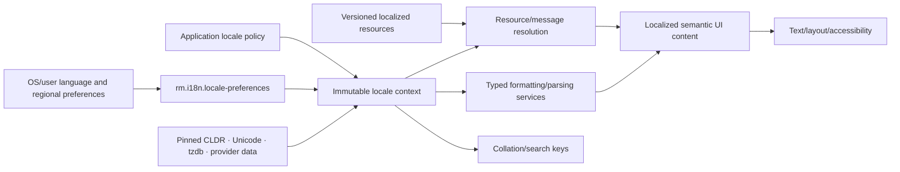

# Internationalization and localization vertical slice

| Field | Value |
|---|---|
| Status | Draft domain analysis |
| Purpose | Make language, locale, resource, formatting, calendar, time-zone, collation, and data-version behavior explicit and reproducible |

## Domain boundary

Locale-sensitive behavior consumes an immutable explicit context containing requested and resolved language/locale preferences, numbering/calendar/hour-cycle/unit/collation choices, time zone, fallback trace, and exact data/provider versions. Changing OS preferences produces a new context; it never mutates in-flight behavior through hidden process globals.

## Architectural conclusions

- Language, formatting region, script, time zone, calendar, numbering system, collation, and measurement policy are distinct inputs.
- Resource lookup and data formatting use explicit fallback traces and report missing/invalid content.
- Messages are translated as complete typed units; applications do not concatenate sentence fragments.
- Human-readable localized output is not canonical serialization or a stable machine identifier.
- Instants, civil date/time fields, calendar systems, time zones, offsets, and display names remain distinct.
- Collation equality/order is versioned user-facing behavior, not object identity or security equivalence.

## Documents

- [`rm.i18n.locale-preferences`](locale-preferences.md)
- [Locale context and negotiation](locale-context.md)
- [Resource and typed-message service](resources-messages.md)
- [Number, currency, unit, date, and duration formatting](formatting.md)
- [Calendar and time-zone service](calendar-timezone.md)
- [Collation and localized search](collation-search.md)
- [Platform and standards research](platform-research.md)
- [Conformance specification](conformance.md)
- [Benchmark specification](benchmarks.md)

