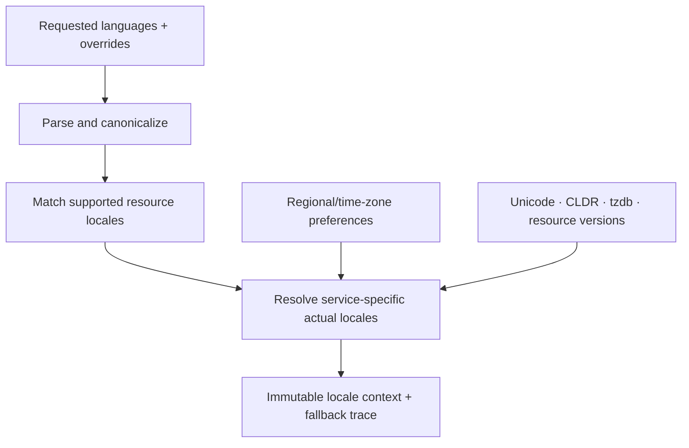

# Locale context and negotiation

**RM-I18N-CONTEXT-0001:** Context creation accepts a preference snapshot revision, product-supported locale/resource manifest, requested overrides, fallback/default policy, time-zone source, and exact Unicode/CLDR/tzdb/provider data versions.

**RM-I18N-CONTEXT-0002:** The immutable result records requested, canonical, maximized/minimized where used, matched resource locale, actual service locales, extension/override values, fallback chain, unsupported values, time-zone identity/version, and context digest.

**RM-I18N-CONTEXT-0003:** Resource-language matching, number/date formatting, collation, segmentation, and display-name services may resolve different actual locales. The context preserves each result and does not collapse them into one “current locale.”

**RM-I18N-CONTEXT-0004:** Fallback is deterministic and bounded by product policy. It never crosses into an unrelated language solely because the platform has data; missing required translation produces a diagnostic or designated product fallback.

**RM-I18N-CONTEXT-0005:** Contexts are passed explicitly to locale-sensitive operations. Libraries do not read or mutate ambient process/thread locale, environment variables, or system preferences during an operation.

**RM-I18N-CONTEXT-0006:** A preference/data/resource update creates a new context. Existing formatted values/layouts remain bound to the old context until the application commits a coordinated semantic/layout/accessibility update.

**RM-I18N-CONTEXT-0007:** Context serialization, if provided, records identifiers and versions but is not proof that another machine has identical resources/data/providers. Resolution is revalidated at the destination.

