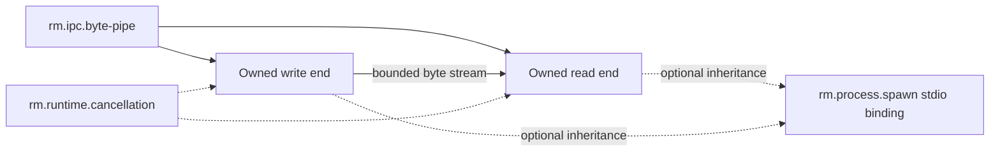

# IPC foundations vertical slice

| Field | Value |
|---|---|
| Status | Draft domain analysis |
| Purpose | Define local anonymous byte transport independently from files, process spawning, terminals, and message protocols |

## Initial boundary

The first IPC capability is a unidirectional anonymous byte pipe with one read end and one write end. It supports local producer/consumer composition and process standard-stream redirection.

Named endpoints, unrelated-process discovery, duplex channels, message boundaries, credential exchange, handle/descriptor passing, shared memory, remote transport, terminal semantics, and serialization protocols remain later capabilities.

## Documents

- [`rm.ipc.byte-pipe`](byte-pipe.md)
- [Platform research](platform-research.md)
- [Conformance specification](conformance.md)
- [Benchmark specification](benchmarks.md)

