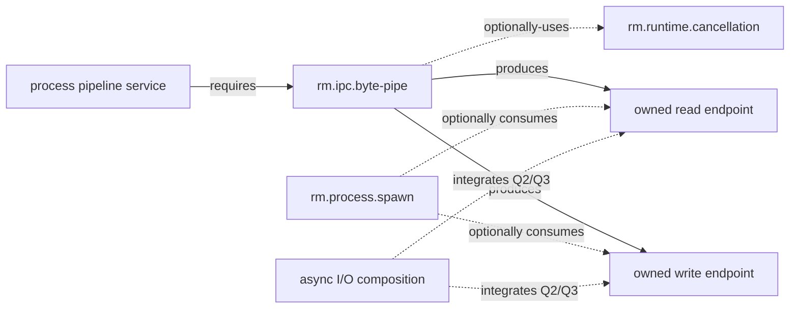

# IPC byte-pipe dependency and profile composition

**Status:** Reviewed domain composition  
**Scope:** IPC foundations 0.1.1

Only `byte-pipe → cancellation` is an IPC capability dependency. Endpoint production, process standard-stream consumption, pipeline service composition, and async readiness/completion integration are separate relationships. Process spawn's optional dependency on byte-pipe is already recorded from the process side.

| Relationship | Type | Required boundary |
|---|---|---|
| byte-pipe → cancellation | optional capability edge | cancellation preserves progress and terminal truth; it cannot roll back accepted bytes |
| spawn → byte-pipe | optional consumer capability edge | explicitly allowlisted endpoint transfer; spawn does not own pipe semantics |
| process pipeline → byte-pipe | required service composition | exact endpoints, duplicates, release/close order, backpressure, capture, and Q-level are manifest inputs |
| async I/O → endpoints | quality/integration relationship | Q2 readiness or Q3 completion is declared; Q1 worker adaptation remains visible and bounded |

The [CLI profile](../profiles/foundation-cli.md) makes byte-pipe optional for redirection/pipelines and requires Q2/Q3 for async use unless bounded Q1 is explicitly accepted. The [server profile](../profiles/foundation-server.md) conditionally selects it for worker capture under the same rule. Headless selection is optional and budgeted; desktop inherits no hidden requirement merely from having process support.

**RM-IPC-DEPENDENCY-0001:** A selecting profile or service MUST resolve compatible byte-pipe, cancellation-if-used, process binding, Q-level, capacity/backpressure, atomicity, transfer, security, and resource-budget constraints.

**RM-IPC-DEPENDENCY-0002:** Capability edges, endpoint data flow, inheritance/transfer, service composition, async quality, and profile membership MUST remain distinct.

**RM-IPC-DEPENDENCY-0003:** Q1 adaptation MUST NOT be represented as native readiness/completion, and optional cancellation MUST NOT create a hidden universal runtime dependency.

**RM-IPC-DEPENDENCY-0004:** Profile satisfaction MUST NOT imply duplex messages, framing, terminals, named discovery, unrelated-process authentication, handle passing, shared memory, remote transport, or fixed capacity/atomicity.
