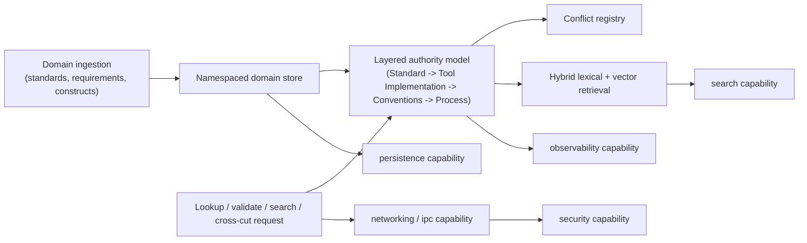

# Rusty Knowledge domain framework

| Field | Value |
|---|---|
| Status | Draft domain analysis |
| Purpose | Serve layered, authority-ranked domain knowledge (standards, requirements, constructs, relationships) to a consumer over a stable query surface, without hiding which layer or source an answer came from |

**Governing proposal:** [RFC-0003](../../rfc/0003-rusty-knowledge-domain-framework.md) (Draft) · **Placement decision:** [ADR-0164](../../adr/0164-rusty-knowledge-is-a-domain-framework.md), [ADR-0165](../../adr/0165-knowledge-layered-authority-carries-over-as-a-requirement.md)

This is a domain framework composed above the `search`, `persistence`, `networking`/`ipc`, `security`, and `observability` capability domains — it is not itself a base OS capability. It exists to give architecture status to behavior an external, working implementation (`baileyrd/knowledge-mcp`) already provides, before a Rust reimplementation is authorized. This document records the framework's shape as input for a future capability-template pass; it is not yet a normative capability specification.

## Conclusions

- A knowledge answer is only meaningful together with its authority layer, source domain, and (if applicable) conflict-registry disposition; returning a bare value without that context is not an acceptable minimum contract.
- One server instance hosting multiple namespaced domains is a framework requirement, not an optional convenience — see [ADR-0165](../../adr/0165-knowledge-layered-authority-carries-over-as-a-requirement.md).
- Retrieval ranking, storage durability, and transport authentication are the responsibility of the `search`, `persistence`, and `security`/`networking` capabilities respectively; this framework composes them and must not silently duplicate or bypass their contracts.
- Hybrid retrieval (lexical plus vector) is the declared default; lexical-only is an allowed degraded mode but must be discoverable as degraded rather than substituted silently.
- Everything in this document is derived from one external, working implementation and has not yet been exercised as a Rust vertical slice; treat conclusions here as trial input, not settled architecture.

## Documents

- [Domain model and query surface](model.md)
- [Platform and ecosystem research](platform-research.md)
- [Conformance specification](conformance.md)
- [Benchmark specification](benchmarks.md)
- [Open questions](open-questions.md)
- [Cross-cutting review](cross-cutting.md) — Unknown, unresolved
- [Ownership and trial readiness](ownership.md) — Unknown, unresolved
- [Experimental promotion review](promotion-review.md) — Proposed; not yet eligible
- [Reviewer-independence waiver](reviewer-independence-waiver.md) — Superseded by [RFC-0004](../../rfc/0004-solo-maintainer-review-sufficiency.md); retained for history

## Decisions

- [ADR-0164: Rusty Knowledge is a domain framework, not a base capability](../../adr/0164-rusty-knowledge-is-a-domain-framework.md)
- [ADR-0165: Knowledge domain layered authority is a portable requirement, not a Python implementation detail](../../adr/0165-knowledge-layered-authority-carries-over-as-a-requirement.md)

## Trial

- [TRIAL-0003: Rusty Knowledge implementation trial](../../05-governance/implementation-trials/rusty-knowledge-trial-proposal.md) — Proposed; authorization blocked

## Boundary

This domain framework does not define retrieval ranking internals, storage engine durability guarantees, transport-level authentication mechanics, or general-purpose observability — those remain the `search`, `persistence`, `networking`/`ipc`, `security`, and `observability` capabilities' concerns. It does not authorize a Rust implementation by itself; RFC-0003 gates that through a bounded implementation trial. It does not migrate or retire the existing Python `knowledge-mcp` server.
