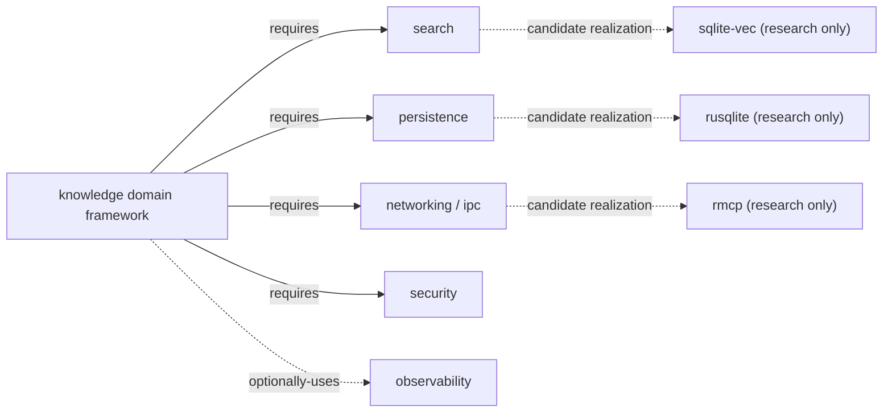

# Knowledge domain-framework dependency and composition register

**Status:** Draft domain composition — `knowledge` has no accepted capability contract; these are framework-level composition edges onto other domains' (also Draft) eventual capabilities, not a reviewed capability graph in the sense [filesystem's register](../filesystem/dependencies.md) is.  
**Scope:** `knowledge` domain framework, per [RFC-0003](../../rfc/0003-rusty-knowledge-domain-framework.md) and [ADR-0164](../../adr/0164-rusty-knowledge-is-a-domain-framework.md)

Dotted arrows are researched candidates from [platform-research.md](platform-research.md), not selected dependencies or accepted capability edges — they exist to show what *would* realize each required edge if a trial were authorized, not to bind it now.

## Edges

| Relationship | Type | Basis | Required boundary |
|---|---|---|---|
| `knowledge` → `search` | `requires` | Hybrid lexical+vector retrieval ([RM-KNOWLEDGE-MODEL-0005](model.md)) is composed from, not reimplemented inside, `knowledge` — per [ADR-0164](../../adr/0164-rusty-knowledge-is-a-domain-framework.md) | `search` is itself Draft with no accepted contract; this edge cannot bind an exact generation until `search` has one |
| `knowledge` → `persistence` | `requires` | Namespaced domain storage ([RM-KNOWLEDGE-MODEL-0001](model.md)) and the conflict registry are durable state `knowledge` does not own the storage semantics of | `persistence` is Draft; same generation caveat |
| `knowledge` → `networking`/`ipc` | `requires` | The MCP transport surface itself; `RK-005` in [TRIAL-0003](../../05-governance/implementation-trials/rusty-knowledge-trial-proposal.md) is the open question of whether either domain, once mature, actually covers MCP semantics | Both Draft; this edge may need to become a new capability rather than an edge onto an existing one, depending on how `RK-005` resolves |
| `knowledge` → `security` | `requires` | Transport-level authentication (bearer-token auth in the Python prior art) is `security`'s concern, not reimplemented in `knowledge` | `security` is Draft; multiple sub-slices (crypto, PKI) exist but none accepted |
| `knowledge` → `observability` | `optionally-uses` | Per-tool-call diagnostics are a stated minimum in RFC-0003's cross-cutting section, but `knowledge` could in principle ship without rich observability at Experimental stage | `observability` is Draft |

## Explicit non-claims

- **No exact generation is bound.** Every domain `knowledge` composes over is itself Draft with no accepted capability contract, so this register cannot do what filesystem's does (bind `>=0.1.0,<0.2.0`-style compatible ranges) — there is nothing yet to bind a range against.
- **This register does not create a profile membership.** No CLI/Desktop/Server/Embedded profile currently references `knowledge`; adding one is a separate decision.
- **Candidate crates in the diagram are not capability realizations.** `sqlite-vec`, `rusqlite`, and `rmcp` are Rust crates researched in [platform-research.md](platform-research.md); they are not `search`, `persistence`, or `networking`/`ipc`'s own accepted providers, which those domains would need to define independently of `knowledge`'s needs.

**RM-KNOWLEDGE-DEPENDENCY-0001:** This register MUST NOT be cited as satisfying [architecture-model.md § 6.2](../../01-architecture/architecture-model.md)'s graph invariants for an accepted capability graph; `knowledge` has no capability nodes yet, only a domain-framework composition intent.

**RM-KNOWLEDGE-DEPENDENCY-0002:** Required edges (`requires`) MUST resolve to compatible generations before any implementation trial authorization; today none can, since the target domains are themselves Draft.

**RM-KNOWLEDGE-DEPENDENCY-0003:** This register's existence resolves [promotion-review.md](promotion-review.md)'s "Dependencies/profile impact" gate from **Fail** (no register existed) toward evaluable — the gate remains open until the edges above bind to exact generations, which requires `search`, `persistence`, `networking`/`ipc`, and `security` to each have their own accepted contracts first.
