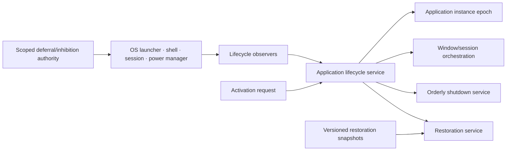

# Application lifecycle and session integration vertical slice

| Field | Value |
|---|---|
| Status | Draft domain analysis |
| Purpose | Model application instances, activation, session/power transitions, cooperative termination, and restoration without promising notification before sudden loss |

## Domain boundary

## Architectural conclusions

- Process existence, application instance, UI activation, foreground/focus, login session, and machine power state are distinct.
- Lifecycle events are observations or bounded requests, not commands that guarantee time or continued execution.
- Orderly shutdown is invoked only when a cooperative lifecycle request permits it; sudden termination bypasses it.
- Durable domain data is committed during ordinary operation. Restoration state is disposable continuity metadata.
- Activation payloads are untrusted typed inputs and do not confer filesystem, network, or account authority.
- Termination deferral/inhibition is separate, scoped authority with deadlines and user-visible policy.

## Documents

- [Instance and launch model](instance-launch.md)
- [Activation and routing](activation.md)
- [Session and power observations](session-power.md)
- [Termination and inhibition](termination-inhibition.md)
- [State preservation and restoration](restoration.md)
- [Platform research](platform-research.md)
- [Conformance specification](conformance.md)
- [Benchmark specification](benchmarks.md)

