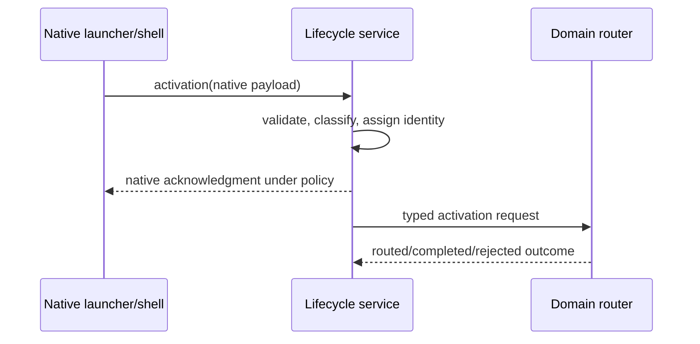

# Activation and routing

## Capability identity

`rm.lifecycle.activation` represents a request for an application instance to handle a user or system intent.

**RM-LIFECYCLE-ACTIVATION-0001:** Activation kinds include ordinary launch, file/document request, URI request, reopen, notification/action, command, restoration continuation, and platform extension. Unsupported kinds remain explicit.

**RM-LIFECYCLE-ACTIVATION-0002:** Every request carries stable identity, native provenance, receipt time, payload schema/version, routing hints, trust class, and acknowledgment/result state.

**RM-LIFECYCLE-ACTIVATION-0003:** Paths, URIs, bookmarks, tokens, and object identifiers are untrusted references. They convey authority only through an explicitly validated capability supplied by the platform adapter.

**RM-LIFECYCLE-ACTIVATION-0004:** Delivery may be at-least-once. Consumers use activation identity and product policy for bounded deduplication; duplicate suppression cannot erase distinct user actions.

**RM-LIFECYCLE-ACTIVATION-0005:** Accepted, routed, presented, completed, rejected, cancelled, expired, and superseded are distinct outcomes. Native acknowledgment does not imply successful domain completion.

**RM-LIFECYCLE-ACTIVATION-0006:** Activation does not itself imply foreground status, input focus, window creation, permission, or user identity.

