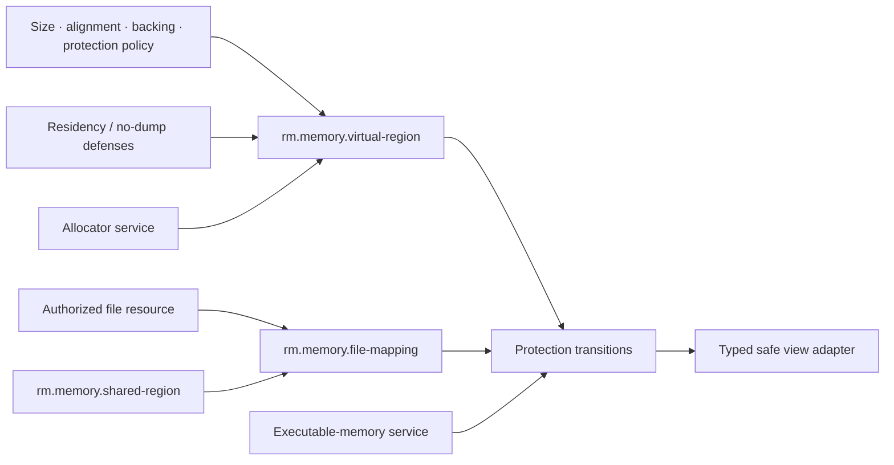

# Memory and mapping foundations vertical slice

| Field | Value |
|---|---|
| Status | Draft domain analysis |
| Purpose | Model virtual address space, backing commitment, mappings, protection, residency controls, shared memory, and allocation policy without confusing them with Rust object ownership or physical-memory guarantees |

## Domain boundary

## Architectural conclusions

- Address reservation, backing commitment, residency, physical allocation, and durability are separate properties.
- Mapping lifetime and Rust reference lifetime must be connected by a safe adapter; raw address ranges are not ordinary slices.
- File-backed mappings inherit file size, truncation, coherence, visibility, and durability hazards.
- Shared memory transfers access to bytes, not synchronization, schema compatibility, object ownership, or trust.
- Page protections are authority-sensitive transitions; writable-and-executable memory is not a baseline capability.
- Memory locking and no-dump controls are defense-in-depth qualities with quotas and gaps, never absolute secrecy.

## Documents

- [Virtual region and backing model](virtual-region.md)
- [File mappings and persistence](file-mapping.md)
- [Shared memory and transfer](shared-memory.md)
- [Protection and executable memory](protection-executable.md)
- [Residency, locking, and discard](residency.md)
- [Allocator service boundary](allocator.md)
- [Platform research](platform-research.md)
- [Conformance specification](conformance.md)
- [Benchmark specification](benchmarks.md)

