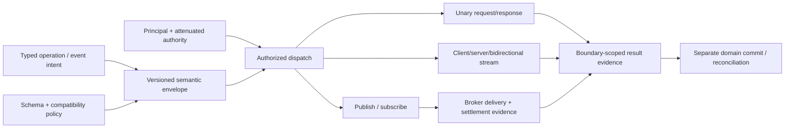

# Application messaging and RPC foundations

| Field | Value |
|---|---|
| Status | Draft domain analysis |
| Purpose | Define typed, evolvable application interactions across in-process, IPC, HTTP, real-time, and brokered transports without overstating delivery or domain-effect guarantees |

## Conclusions

- Remote calls are asynchronous distributed interactions with partial failure, not local procedure calls with network syntax.
- The semantic message model is independent of wire encoding and transport; every binding declares exactly what it preserves, adds, or cannot support.
- Transport send, broker acceptance, delivery, settlement, consumer acknowledgment, handler return, durable commit, and externally visible domain effect are separate milestones.
- “Exactly once” is not a portable transport quality. Products compose idempotency, deduplication, transactions, durable state, and reconciliation for a precisely named effect boundary.
- Schema evolution is directional and encoding-specific; syntactic parse success does not establish semantic compatibility.

## Documents

- [Interaction and capability model](interaction-model.md)
- [Schemas and semantic envelopes](schema-envelope.md)
- [Unary RPC lifecycle](rpc.md)
- [Streaming interactions](streaming.md)
- [Delivery, acknowledgment, and settlement](delivery-settlement.md)
- [Publish/subscribe and broker boundary](pubsub-broker.md)
- [Retries, idempotency, deduplication, and reconciliation](retries-idempotency.md)
- [Security, privacy, accessibility, i18n, and observability](cross-cutting.md)
- [Protocol and platform research](platform-research.md)
- [Conformance specification](conformance.md)
- [Benchmark specification](benchmarks.md)

