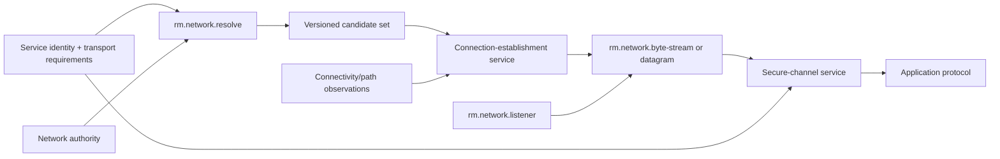

# Networking foundations vertical slice

| Field | Value |
|---|---|
| Status | Draft domain analysis |
| Purpose | Provide authority-scoped name resolution, endpoint selection, byte-stream/datagram transport, listening, path observation, and secure-channel composition with explicit milestones and variance |

## Domain boundary

## Architectural conclusions

- Service identity, DNS name, IP address, interface, route/path, socket endpoint, and authenticated peer identity are distinct.
- Resolution produces expiring candidates with provenance; it grants neither authority nor authentication.
- Connection establishment may race candidates, but it commits exactly one winner and closes losers deterministically.
- Byte streams preserve order, not writes or messages; datagrams preserve individual message boundaries but may lose, duplicate, reorder, or truncate.
- Connectivity observation is a hint scoped to requirements and process policy, not proof that a destination or the Internet is reachable.
- Secure transport is a service composed over transport; authentication binds the original service identity and policy, not the selected address alone.

## Documents

- [Endpoint and service identity](endpoint-identity.md)
- [Name and service resolution](resolution.md)
- [Connection establishment and racing](connection-establishment.md)
- [Connected byte streams](byte-stream.md)
- [Datagrams](datagram.md)
- [Listeners and accepted connections](listener.md)
- [Connectivity and path observation](connectivity.md)
- [Secure-channel boundary](secure-channel.md)
- [Secure transport and channel foundations](secure-transport-README.md)
- [Platform research](platform-research.md)
- [Conformance specification](conformance.md)
- [Benchmark specification](benchmarks.md)
