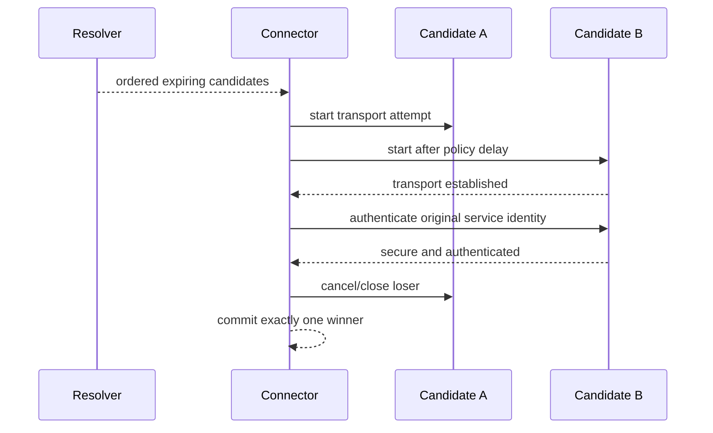

# Connection establishment and candidate racing

## Platform service

The connection-establishment service composes resolution, path policy, timers, transport creation, and optional secure-channel negotiation.

**RM-NETWORK-CONNECT-0001:** A connection attempt has one overall monotonic deadline plus bounded per-candidate scheduling policy; DNS, proxy, transport, security, and application-readiness milestones remain separately timed.

**RM-NETWORK-CONNECT-0002:** Candidate racing preserves resolver/policy preference while avoiding serial stalls. Parallelism, delay, interface use, and resource budgets are explicit and versioned.

**RM-NETWORK-CONNECT-0003:** Exactly one candidate may commit. Losing or superseded attempts are cancelled and closed; late completion cannot escape as an unowned connection.

**RM-NETWORK-CONNECT-0004:** Transport-established, proxy-established, cryptographically-secure, peer-authenticated, and application-protocol-ready are distinct milestones.

**RM-NETWORK-CONNECT-0005:** The terminal report records every attempted candidate, start/finish ordering, stage outcome, cancellation classification, selected local/remote observations, path epoch, and degradation without exposing secrets.

**RM-NETWORK-CONNECT-0006:** A path change or new DNS answer does not silently migrate a non-migratable transport. Reconnection or transport-specific migration is explicit higher-layer policy.

