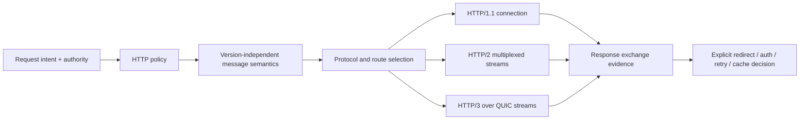

# HTTP client and server foundations

| Field | Value |
|---|---|
| Status | Draft domain analysis |
| Purpose | Preserve HTTP semantics across HTTP/1.1, HTTP/2, and HTTP/3 while exposing exact policy, streaming, intermediation, retry, and failure evidence |

## Conclusions

- One semantic request/response model spans HTTP versions; protocol adapters preserve framing, concurrency, flow-control, and failure-scope differences.
- Message heads are bounded typed metadata and content is a backpressured stream. Buffering is always an explicit policy decision.
- Origin, connection peer, proxy, authenticated principal, certificate identity, and authority to perform an operation remain distinct.
- Redirect, authentication challenge, retry, cache use, protocol fallback, and proxy traversal are observable policy transitions, never invisible library behavior.
- Cancellation and transport failure report what may have crossed each boundary; they do not establish that an origin did not act.

## Documents

- [Semantic message and exchange model](http-message-exchange.md)
- [Protocol selection and connection management](http-protocol-connections.md)
- [Streaming, backpressure, cancellation, and failure](http-streaming-failure.md)
- [Redirects, authentication, retries, and replay](http-policy-transitions.md)
- [Proxies, gateways, tunnels, and caching](http-intermediation-cache.md)
- [Server lifecycle and request dispatch](http-server.md)
- [Security, privacy, accessibility, i18n, and observability](http-cross-cutting.md)
- [Protocol and platform research](http-platform-research.md)
- [Conformance specification](http-conformance.md)
- [Benchmark specification](http-benchmarks.md)

