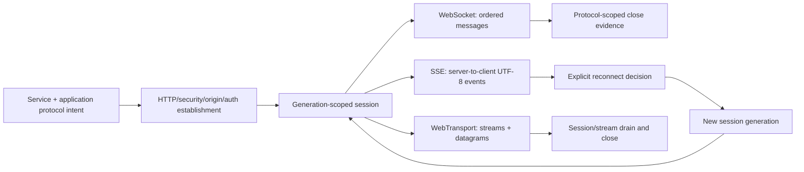

# Real-time application transport foundations

| Field | Value |
|---|---|
| Status | Draft domain analysis |
| Purpose | Establish policy-bound WebSocket, server-sent event, and WebTransport sessions without erasing their different data and delivery semantics |

## Conclusions

- WebSocket, SSE, and WebTransport share authority, establishment, lifecycle, resource, and observability policy but not one portable data primitive.
- Handshake acceptance establishes a protocol session, not application authentication, subscription authorization, durable delivery, or readiness of a domain workflow.
- Reconnect always creates a new session generation. Resume cursors and acknowledgments are application evidence, not transport proof of exactly-once continuity.
- Backpressure, cancellation, keepalive, proxy behavior, suspension, migration, and close retain protocol-specific meaning and evidence.
- Async-first APIs expose bounded queues and partial progress; sync-complete APIs never create hidden runtimes or nested event loops.

## Documents

- [Common session and establishment model](realtime-session.md)
- [WebSocket contract](realtime-websocket.md)
- [Server-sent events contract](realtime-sse.md)
- [WebTransport contract](realtime-webtransport.md)
- [Reconnect, resume, replay, and liveness](realtime-continuity.md)
- [Security, privacy, accessibility, i18n, and observability](realtime-cross-cutting.md)
- [Protocol and platform research](realtime-platform-research.md)
- [Conformance specification](realtime-conformance.md)
- [Benchmark specification](realtime-benchmarks.md)

