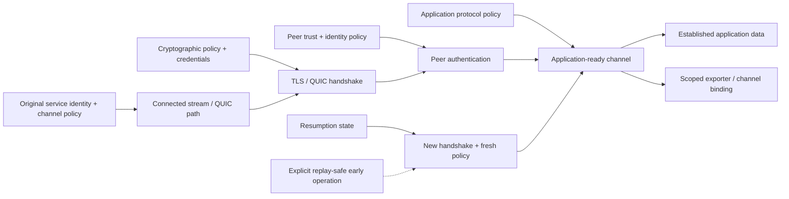

# Secure transport and channel foundations

| Field | Value |
|---|---|
| Status | Draft domain analysis |
| Purpose | Establish authenticated TLS and QUIC channels with exact negotiation, replay, resumption, binding, data, migration, and closure evidence |

## Conclusions

- Transport establishment, cryptographic handshake, peer certificate/key verification, original service-identity validation, client authentication, application-protocol negotiation, and application readiness are separate milestones.
- Negotiation is constrained by immutable channel policy; provider defaults and downgrade/fallback cannot silently weaken versions, algorithms, authentication, privacy, or application protocol.
- Resumption establishes a new channel and revalidates all material current policy. Tickets are scoped bearer-like secrets, not cached trust decisions.
- Early data is disabled by default and, when selected, is a separately typed replayable operation with server-side anti-replay and application deduplication/authorization policy.
- TLS byte streams and QUIC streams/datagrams preserve their native data and closure semantics. Encryption does not create messages, exactly-once delivery, durable acknowledgment, or application authorization.

## Documents

- [Channel model and readiness](secure-transport-channel-model.md)
- [Policy and negotiation](secure-transport-negotiation.md)
- [Peer authentication and credentials](secure-transport-authentication.md)
- [Handshake and lifecycle](secure-transport-handshake.md)
- [Protected data and closure](secure-transport-data-close.md)
- [Resumption and early data](secure-transport-resumption.md)
- [Exporters and channel binding](secure-transport-exporters.md)
- [QUIC-specific transport](secure-transport-quic.md)
- [Security, privacy, and accessibility](secure-transport-security-accessibility.md)
- [Platform and protocol research](secure-transport-platform-research.md)
- [Conformance](secure-transport-conformance.md)
- [Benchmarks](secure-transport-benchmarks.md)

