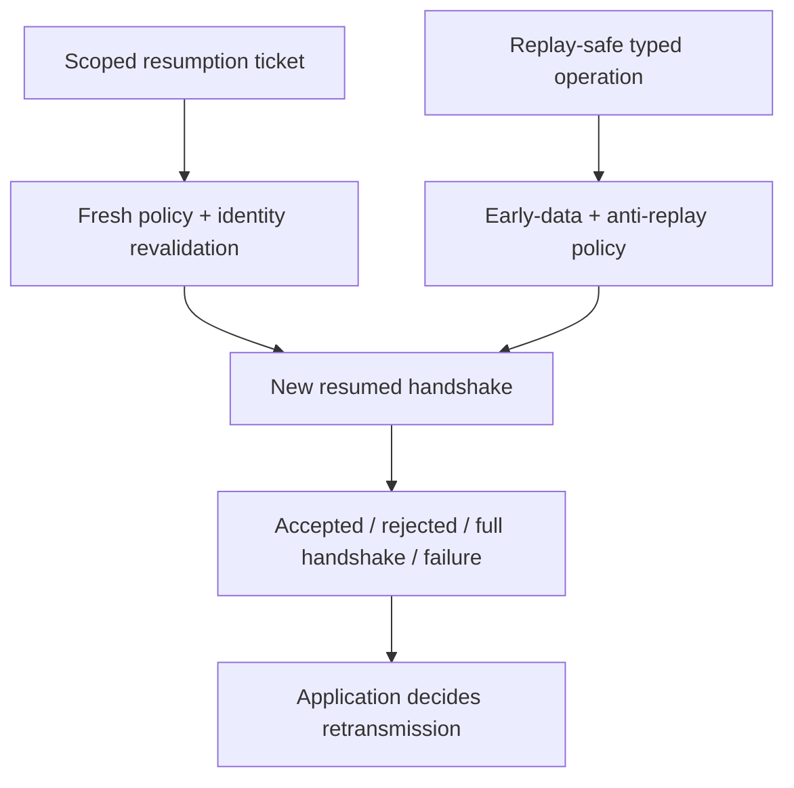

# Resumption and early data

**RM-SECURE-RESUMPTION-0001:** Session tickets/PSKs are secret, opaque, provider/profile-scoped credentials with issue/receipt time, lifetime, original service/SNI, ALPN, server identity/trust context, client-auth state, cipher/hash, early-data limit, topology/tenant, and policy generations.

**RM-SECURE-RESUMPTION-0002:** Ticket storage uses secret-store protections, bounded count/bytes/lifetime, tenant/profile isolation, least disclosure, single-/multi-use policy, clock handling, rotation, invalidation, and destruction. Tickets are not logs or portable caches by default.

**RM-SECURE-RESUMPTION-0003:** A resumed connection is a new channel. It revalidates current service identity, policy, ALPN, trust/distrust/revocation requirements, credential/client-auth continuity, ticket scope/freshness, provider, network/proxy/privacy, and target authorization before application readiness.

**RM-SECURE-RESUMPTION-0004:** Resumption accepted/rejected/not attempted/fell back/full-handshake/PSK-only/PSK-with-fresh-key-exchange are distinct. Rejection may retry a full handshake but never with weaker policy or automatic application replay.

**RM-SECURE-EARLY-0001:** Early data is disabled by default. Enabling requires a typed operation whose request bytes, identity/authorization context, replay safety/idempotency, freshness, side effects, response handling, deduplication key, maximum size, ALPN, and fallback are explicit.

**RM-SECURE-EARLY-0002:** Early data is classified as replayable, lacks ordinary full-handshake freshness/forward-secrecy properties, and may arrive before client authentication. It cannot perform privilege changes, financial/non-idempotent effects, secret rotation, destructive actions, or one-time-token consumption unless a higher protocol supplies proven replay protection.

**RM-SECURE-EARLY-0003:** Servers apply ticket age/scope, distributed anti-replay window/store, topology consistency, clock, address/path, application deduplication, rate, and capacity policy. Anti-replay unavailable or indeterminate rejects early data rather than downgrading the claim.

**RM-SECURE-EARLY-0004:** Early data outcomes distinguish not sent, sent/possibly received, accepted, rejected/discarded, partially processed, replay detected, application committed, and indeterminate. Rejection never triggers automatic retransmission; the application decides using operation identity and evidence.

