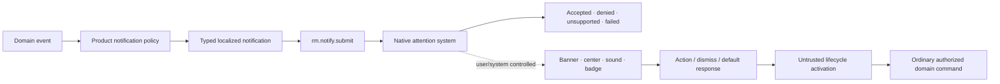

# Notifications and user-attention foundations vertical slice

| Field | Value |
|---|---|
| Status | Draft domain analysis |
| Purpose | Request timely user attention through native notification systems without claiming presentation, interruption, retention, or action execution guarantees |

## Conclusions

- Notification submission, native presentation, user interruption, retention/history, remote push delivery, and application activation are separate milestones.
- Importance and urgency express product intent; user/system focus, quiet-hours, accessibility, rate, and policy decide effective attention.
- Content is a typed localized snapshot with expiry and privacy classification, not a free-form platform payload.
- Notification actions are untrusted activation requests, never pre-authorized domain commands.
- Replacement, progress, badge, scheduling, withdrawal, and history are optional capabilities with explicit quality and reconciliation.
- Remote push transport, background execution, alarms, calls, and emergency alerts remain separately governed services.

## Documents

- [Content and identity](content-identity.md)
- [Submission and delivery milestones](submission-delivery.md)
- [Attention and interruption policy](attention-policy.md)
- [Actions and activation](actions-activation.md)
- [Replacement, progress, badges, and withdrawal](state-updates.md)
- [Scheduling and lifecycle](scheduling-lifecycle.md)
- [Privacy, security, and accessibility](privacy-accessibility.md)
- [Platform research](platform-research.md)
- [Conformance](conformance.md)
- [Benchmarks](benchmarks.md)
