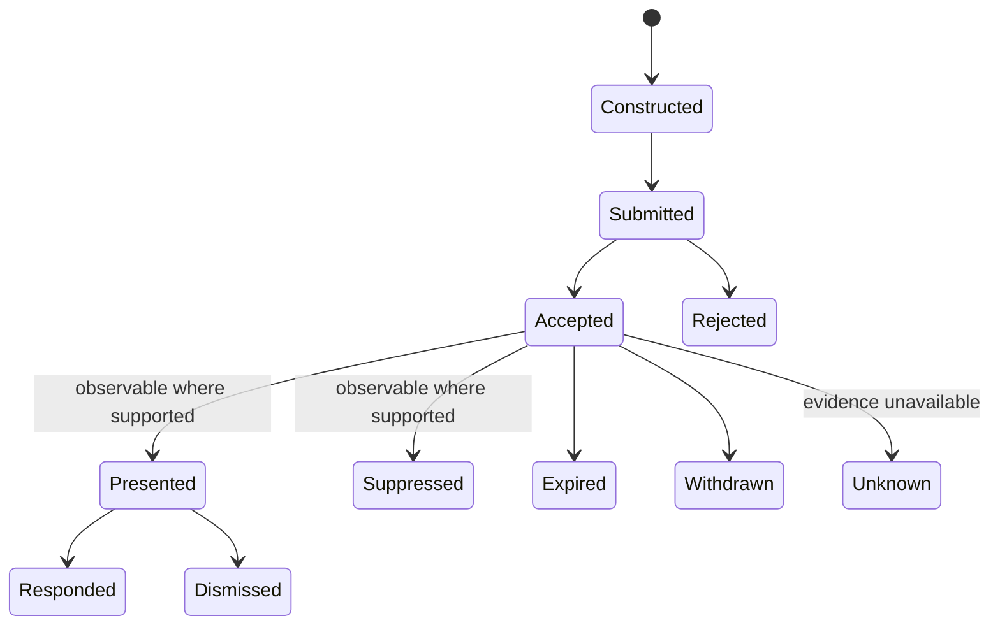

# Notification submission and delivery milestones

**RM-NOTIFY-DELIVERY-0001:** Submission success MUST mean only that the selected native provider accepted the request under its current contract.

**RM-NOTIFY-DELIVERY-0002:** Accepted, presented, announced, retained in history, remotely delivered, responded, dismissed, expired, suppressed, and unknown MUST NOT be collapsed into one “delivered” state.

**RM-NOTIFY-DELIVERY-0003:** Providers MUST report which post-acceptance milestones are observable and their evidence quality. Absence of a callback MUST NOT be interpreted as suppression or dismissal.

**RM-NOTIFY-DELIVERY-0004:** Submission failure MUST distinguish invalid content, unsupported feature, identity/registration failure, user/system policy denial, rate/resource limit, unavailable session/service, and provider failure.

**RM-NOTIFY-DELIVERY-0005:** The application MUST NOT use notification delivery as a correctness, audit, safety, authentication, or durable-message channel.

See [ADR-0058](../../adr/0058-notification-submission-is-not-presentation.md).
