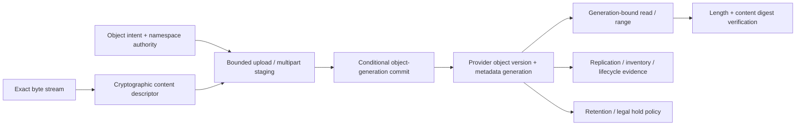

# Object, blob, and content-addressed storage foundations

| Field | Value |
|---|---|
| Status | Draft domain analysis |
| Purpose | Store and retrieve bounded immutable or versioned byte objects with exact identity, conditional mutation, transfer, retention, replication, and recovery evidence |

## Conclusions

- Namespace key, provider generation/version, validator/ETag, checksum, and cryptographic content descriptor are different identities with different scopes.
- Multipart/resumable uploads are invisible staging attempts until a conditional completion commits one new object generation; uploaded parts alone are not the object.
- Reads, ranges, copies, metadata changes, deletes, restores, and lifecycle actions bind exact generations to avoid mixed-version or wrong-target effects.
- Retention, legal hold, versioning, replication, inventory, and deletion are policy/evidence layers; a configured rule is not proof of enforcement or recovery.
- Content addressability establishes exact-byte identity after verification, not provenance, safety, authorization, semantic type, availability, or trusted metadata.

## Documents

- [Object-storage model and capability boundary](object-model.md)
- [Namespaces, keys, versions, and identity](identity-namespaces.md)
- [Reads, ranges, and streaming](reads-ranges.md)
- [Writes, multipart uploads, copies, and composition](writes-multipart.md)
- [Conditional operations, versioning, and deletion](conditional-versioning.md)
- [Metadata, listing, inventory, and events](metadata-listing.md)
- [Content-addressed storage](content-addressed.md)
- [Delegated and presigned access](delegated-access.md)
- [Lifecycle, retention, legal hold, and erasure](lifecycle-retention.md)
- [Replication, recovery, and portability](replication-recovery.md)
- [Security, privacy, accessibility, i18n, and observability](cross-cutting.md)
- [Provider research](platform-research.md)
- [Conformance specification](conformance.md)
- [Benchmark specification](benchmarks.md)

