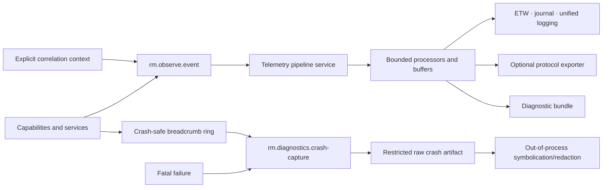

# Observability, diagnostics, and crash-reporting vertical slice

| Field | Value |
|---|---|
| Status | Draft domain analysis |
| Purpose | Produce structured, bounded, privacy-aware operational evidence without coupling application behavior to an exporter or assuming the normal runtime survives failure |

## Domain boundary

## Architectural conclusions

- Events are immutable typed records with stable schema identity; rendered log text is a view, not the source of truth.
- Correlation context is explicit, immutable, and authority-neutral. It never grants access or proves identity.
- Producing telemetry is independent of processing, retention, transport, and vendor export.
- Backpressure, sampling, coalescing, loss, and shutdown behavior are observable and bounded.
- Sensitive-field classification occurs in the event schema before values enter a pipeline.
- Crash capture is minimal and async-signal/crash-context constrained; enrichment and symbolication occur out of process.
- Raw memory dumps are highly sensitive diagnostic artifacts, not ordinary logs.
- Telemetry is evidence about execution, never an authorization or correctness oracle.

## Documents

- [Structured event and schema model](event-schema.md)
- [Correlation, causality, and time](context-causality.md)
- [Pipeline, processing, and export](pipeline-export.md)
- [Metrics and tracing](metrics-tracing.md)
- [Diagnostic bundles](diagnostic-bundles.md)
- [Crash capture and analysis](crash-capture.md)
- [Privacy, security, and governance](privacy-security.md)
- [Platform research](platform-research.md)
- [Conformance specification](conformance.md)
- [Benchmark specification](benchmarks.md)

