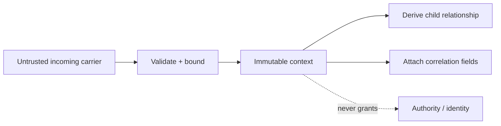

# Correlation, causality, and time

## Capability identity

`rm.observe.context` carries immutable correlation and trace relationships across explicit boundaries.

**RM-OBSERVE-CONTEXT-0001:** Context distinguishes trace identity, span identity, parent relationship, baggage-like application fields, sampling intent, and vendor state. Unknown extension fields remain bounded and do not alter authority.

**RM-OBSERVE-CONTEXT-0002:** Context propagation is explicit across task, process, IPC, and network boundaries. Thread-local or task-local convenience adapters may exist but cannot be the semantic source of truth.

**RM-OBSERVE-CONTEXT-0003:** Incoming context is untrusted input. Identifiers, length, field count, encoding, and propagation depth are validated; remote sampling intent is policy input, not a command.

**RM-OBSERVE-CONTEXT-0004:** Trace correlation expresses an asserted causal relationship, not authenticated identity, authorization, clock synchronization, or proof that every intermediate operation was recorded.

**RM-OBSERVE-CONTEXT-0005:** Each record identifies its timestamp domain and quality. Monotonic timestamps/order measure local intervals; civil/UTC correlation carries clock-source and uncertainty/discontinuity evidence where available.

**RM-OBSERVE-CONTEXT-0006:** Process and resource identifiers include an epoch or execution identity sufficient to prevent silent correlation across identifier reuse.

