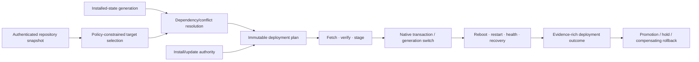

# Package installation and update-orchestration foundations

| Field | Value |
|---|---|
| Status | Draft domain analysis |
| Purpose | Discover, plan, stage, install, update, roll back, remove, and recover software packages through native facilities while preserving exact authority and evidence |

## Conclusions

- Repository metadata, artifact signatures, dependency resolution, deployment authority, native installation, application health, and product success are separate evidence and policy boundaries.
- Update selection uses a complete authenticated repository snapshot with freshness, rollback, freeze, mix-and-match, delegation, channel, target, and rollout policy.
- A deployment plan is immutable and generation-bound. The executor cannot silently re-resolve dependencies, change targets, broaden scope, or add hooks.
- Installation is a journaled state transition with explicit preflight, staging, commit, activation, reconciliation, and cleanup milestones. “Committed” does not imply healthy or user-visible success.
- Rollback is a new compensating deployment. Executable rollback does not imply configuration, database, credential, cache, or user-data rollback is safe.

## Documents

- [Package identity and installed state](identity-installed-state.md)
- [Repository and update metadata](repository-update-metadata.md)
- [Resolution and deployment plans](resolution-plans.md)
- [Staging and transactions](staging-transactions.md)
- [Hooks, services, configuration, and data](hooks-services-data.md)
- [Rollout and health](rollout-health.md)
- [Rollback, removal, and recovery](rollback-recovery.md)
- [Platform research](platform-research.md)
- [Security, privacy, and accessibility](security-accessibility.md)
- [Conformance](conformance.md)
- [Benchmarks](benchmarks.md)

