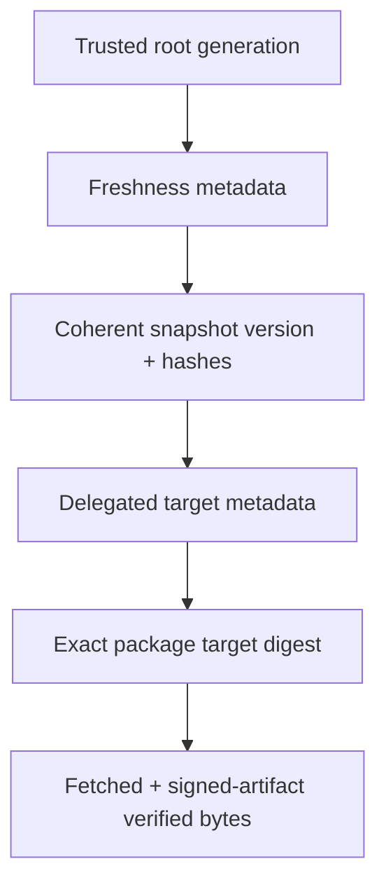

# Repository and update metadata

**RM-PACKAGE-REPOSITORY-0001:** An update source is configured by stable identity, repository root/trust generation, metadata profile, base endpoints/mirrors, namespace/delegation scope, channels, network/privacy policy, and priority. A URL alone is not trust configuration.

**RM-PACKAGE-REPOSITORY-0002:** Clients verify root/delegation, freshness/timestamp, snapshot, and target metadata according to the selected profile before choosing artifacts. Role/key thresholds and offline/online key separation remain evidence.

**RM-PACKAGE-REPOSITORY-0003:** One resolution cycle uses a coherent authenticated repository snapshot. Version/hash/length links prevent mix-and-match; monotonic trusted metadata and expiration prevent rollback/freeze within declared clock and offline limits.

**RM-PACKAGE-REPOSITORY-0004:** Metadata and targets have strict size/count/depth/decompression/redirect/mirror/request/time bounds. Downloads are content-addressed where possible and verified for length and digest before signed-artifact acceptance.

**RM-PACKAGE-REPOSITORY-0005:** Target metadata declares package identity/digest/length, platform/architecture/compatibility, dependency metadata generation, channel, rollout eligibility, urgency, minimum updater/policy version, revocations, and optional delta relationships.

**RM-PACKAGE-REPOSITORY-0006:** Delta selection is an optimization. The reconstructed full artifact must match the accepted target digest; failure falls back only when policy permits and never changes selected identity.

**RM-PACKAGE-REPOSITORY-0007:** Mirror transport authentication is defense in depth, not repository authorization. Mirror failure, equivocation, stale content, and corruption retain per-endpoint evidence and bounded failover.

**RM-PACKAGE-REPOSITORY-0008:** Air-gapped/offline bundles include all required metadata, trust transitions, artifacts, expiry/freshness policy, and an export manifest. Offline acceptance cannot silently claim current global availability or revocation state.

**RM-PACKAGE-REPOSITORY-0009:** Update discovery returns candidates and policy explanations, not installation authority. Product/user/admin policy separately decides automatic download, staging, prompting, installation, or deferral.

