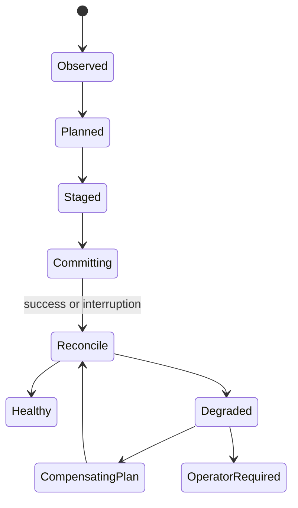

# Rollback, removal, and recovery

**RM-PACKAGE-RECOVERY-0001:** Rollback is a newly resolved, authorized, journaled compensating deployment from observed current state to a declared target generation. It is not execution of an inverse log.

**RM-PACKAGE-RECOVERY-0002:** Rollback policy binds eligible prior artifacts/metadata, downgrade authorization, vulnerability/revocation status, retained-generation integrity, configuration/data compatibility, service/checkpoint compatibility, deadline, and health gate.

**RM-PACKAGE-RECOVERY-0003:** Last-known-good identifies exact package set, state generation, activation/health evidence, time, environment, and policy. “Previously installed” alone is insufficient and may be revoked or incompatible with migrated state.

**RM-PACKAGE-RECOVERY-0004:** Automatic rollback stops new admission where relevant, preserves diagnostic evidence, evaluates data/config compatibility, applies the compensating plan, reconciles activation, verifies health, and reports residual/ambiguous state.

**RM-PACKAGE-RECOVERY-0005:** Boot/session recovery, safe mode, offline servicing, alternate root/volume, and external recovery environment are distinct capabilities with explicit trust, authority, target-root, mount, encryption, and native-database constraints.

**RM-PACKAGE-RECOVERY-0006:** Interrupted deployment recovery inspects durable journal plus authoritative native/package/filesystem state. It may resume, repair, complete forward, compensate, quarantine, or require operator action; it never assumes the pre-operation state survived.

**RM-PACKAGE-RECOVERY-0007:** Repair verifies owned content and registration against accepted package manifests, restores only authorized immutable content, preserves or diagnoses local configuration/data, and does not silently upgrade.

**RM-PACKAGE-RECOVERY-0008:** Removal orders admission closure, drain/stop, trigger/handler/service unregistration, shared-reference release, content removal, optional configuration/data purge, credential cleanup, and residual-state evidence. Failure remains recoverable and idempotent.

