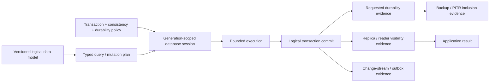

# Application data persistence and database foundations

| Field | Value |
|---|---|
| Status | Draft domain analysis |
| Purpose | Persist typed application state with exact transaction, isolation, durability, migration, change, replication, and recovery evidence across embedded and service databases |

## Conclusions

- Logical records, keys, relations, constraints, and queries are capability contracts, not a portable least-common-denominator SQL dialect.
- Transaction commit, requested durability, replica visibility, backup/PITR inclusion, change-feed publication, and external side effects are separate milestones.
- Isolation names are accepted only with precise anomaly/history semantics and provider mappings.
- Schema migration is a versioned compatibility rollout across readers, writers, indexes, constraints, backfills, replicas, backups, and rollback horizons—not a one-shot DDL script.
- Backups are candidates for recovery until restore and semantic verification prove a usable new database generation.

## Documents

- [Persistence model and capabilities](persistence-model.md)
- [Logical data, records, keys, and queries](data-query-model.md)
- [Connections, sessions, statements, and pooling](sessions-pooling.md)
- [Transactions, isolation, and durability](transactions.md)
- [Constraints, indexes, and concurrency](constraints-indexes.md)
- [Schema evolution and migrations](migrations.md)
- [Change streams and integration](change-streams.md)
- [Backup, restore, and point-in-time recovery](backup-recovery.md)
- [Replication, consistency, and failover](replication-failover.md)
- [Security, privacy, accessibility, i18n, and observability](cross-cutting.md)
- [Provider and platform research](platform-research.md)
- [Conformance specification](conformance.md)
- [Benchmark specification](benchmarks.md)

