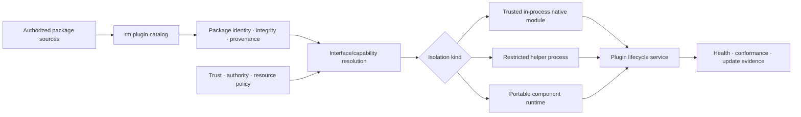

# Plugin and module lifecycle vertical slice

| Field | Value |
|---|---|
| Status | Draft domain analysis |
| Purpose | Discover, verify, resolve, instantiate, govern, update, and retire extension packages across explicit trust and isolation boundaries |

## Domain boundary

## Conclusions

- Package identity, publisher provenance, interface compatibility, trust, and authority are independent.
- Discovery reads metadata without executing plugin code.
- In-process native modules are trusted components, not a sandbox.
- Process and component isolation still require explicit capability grants, quotas, and mediated I/O.
- Rust ABI compatibility is not assumed across independently compiled dynamic libraries.
- Unload is not a portable safety guarantee; quiescence and generation retirement are the common model.
- Updates activate new immutable generations; running code is never overwritten in place.

## Documents

- [Package identity and manifest](package-manifest.md)
- [Discovery and selection](discovery-resolution.md)
- [Interfaces and compatibility](interfaces-compatibility.md)
- [Trust, authority, and isolation](trust-isolation.md)
- [Activation and lifecycle](activation-lifecycle.md)
- [Update and rollback](update-rollback.md)
- [Platform research](platform-research.md)
- [Conformance specification](conformance.md)
- [Benchmark specification](benchmarks.md)

