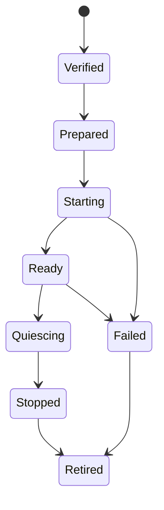

# Activation and lifecycle

## Platform service

**RM-PLUGIN-LIFECYCLE-0001:** A selected plugin generation transitions through verified, prepared, starting, ready, quiescing, stopped, failed, and retired. Every instance has package digest, interface plan, isolation provider, authority grant, and execution epoch.

**RM-PLUGIN-LIFECYCLE-0002:** Preparation resolves dependencies and reserves resources without publishing service availability. Activation commits exports atomically only after readiness.

**RM-PLUGIN-LIFECYCLE-0003:** Initialization has monotonic deadline, cancellation, reentrancy policy, and failure cleanup. Native loader constructors are outside portable control and therefore make in-process packages higher risk.

**RM-PLUGIN-LIFECYCLE-0004:** Calls bind a generation lease. Quiescing rejects new calls, awaits/cancels owned work under policy, revokes brokered grants where possible, and produces a terminal report.

**RM-PLUGIN-LIFECYCLE-0005:** `stopped` does not imply native code bytes can be safely unloaded. Function pointers, TLS destructors, callbacks, threads, allocator ownership, native dependencies, and OS loader references may outlive logical shutdown.

**RM-PLUGIN-LIFECYCLE-0006:** Crash/trap/disconnect health transitions are explicit. Restart uses bounded rate/backoff and fresh generation authority; state recovery is versioned product policy, not automatic replay.

