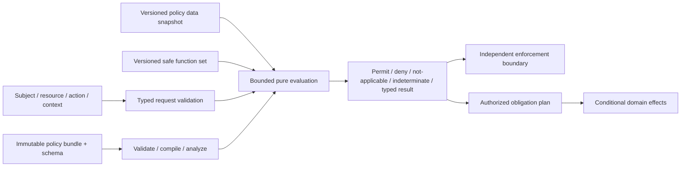

# Application policy and rules-evaluation foundations

| Field | Value |
|---|---|
| Status | Draft domain analysis |
| Purpose | Evaluate versioned typed policies into evidence-rich decisions without conflating policy interpretation, enforcement, obligations, or domain effects |

## Conclusions

- A policy decision is evidence over exact policy, input, data, schema, function, evaluator, and time generations; it is not a capability token or completed effect.
- Authorization policy, routing/admission policy, validation, feature/configuration rules, and business decisions share evaluation machinery but retain separate result and enforcement semantics.
- Missing, unknown, error, not-applicable, indeterminate, deny, and false are distinct states; security-sensitive enforcement defaults fail closed under explicit policy.
- Obligations require understood, authorized, atomic or reconciled enforcement; advice can be ignored only when the selected contract says so.
- Explanation, tracing, simulation, and decision logs are privileged derived evidence with privacy and stability limits.

## Documents

- [Model, entities, and milestones](model.md)
- [Policy domains and decision contracts](decision-contracts.md)
- [Typed inputs, schemas, and data](inputs-data.md)
- [Language, functions, and evaluation](language-evaluation.md)
- [Composition and conflict resolution](composition.md)
- [Obligations, advice, and enforcement](obligations-enforcement.md)
- [Partial evaluation, caching, and freshness](partial-cache.md)
- [Distribution, activation, and rollback](distribution-lifecycle.md)
- [Testing, simulation, and change analysis](testing-simulation.md)
- [Explanation, audit, and privacy](explanation-audit.md)
- [Security and isolation](security.md)
- [Cross-cutting qualities](cross-cutting.md)
- [Platform and provider research](platform-research.md)
- [Conformance](conformance.md)
- [Benchmarks](benchmarks.md)

## Decisions

- [ADR-0116: Policy decisions are evidence, not effect authority](../../adr/0116-policy-decisions-are-evidence-not-effect-authority.md)
- [ADR-0117: Policy evaluation binds immutable policy and input snapshots](../../adr/0117-policy-evaluation-binds-immutable-policy-and-input-snapshots.md)

## Boundary

This domain composes identity, authorization, configuration, interchange, observability, caching, service traffic, persistence, and signed artifacts. It does not choose product policies, languages/engines, schemas, data sources, combining algorithms, obligations, deployment topology, objectives, or legal meaning; products select those through RFCs.
