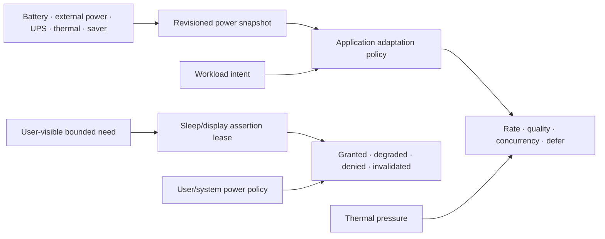

# Power and energy-management foundations vertical slice

| Field | Value |
|---|---|
| Status | Draft domain analysis |
| Purpose | Observe power/thermal conditions and express bounded workload or sleep-policy intent without promising energy, performance, or continued execution |

## Conclusions

- Power source, battery inventory, aggregate charge, charge/discharge rate, remaining-time estimates, energy saver, thermal pressure, and system sleep state are separate observations.
- Values are revisioned, source-qualified estimates; percentage and time remaining are not energy budgets or deadlines.
- Workload intent and quality adaptation are application policy. The platform may ignore, clamp, or override requests.
- Sleep/display assertions are short-lived purpose-bound leases, not guarantees against suspend, shutdown, lid close, battery exhaustion, policy, or failure.
- System suspend/hibernate/restart/power-off initiation, wake scheduling, device power control, charging limits, and performance overclocking are separate privileged services.

## Documents

- [Power-source and battery observation](battery-observation.md)
- [Energy saver and workload adaptation](energy-policy.md)
- [Thermal and performance pressure](thermal-performance.md)
- [Sleep and display assertions](assertion-leases.md)
- [Sleep, wake, and lifecycle integration](sleep-lifecycle.md)
- [Budgets, measurement, and observability](budgets-observability.md)
- [Security, privacy, and accessibility](security-accessibility.md)
- [Platform research](platform-research.md)
- [Conformance](conformance.md)
- [Benchmarks](benchmarks.md)
