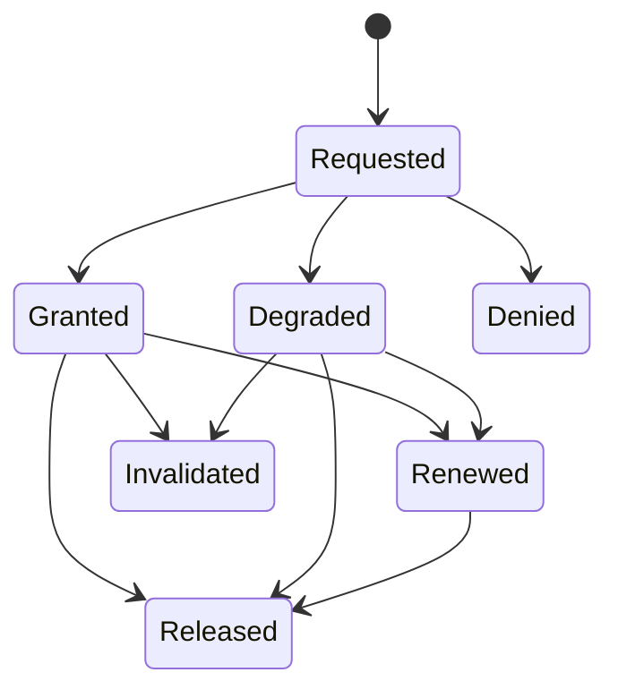

# Sleep and display assertion leases

An assertion lease requests that one automatic policy action be deferred while a bounded user-visible need is active. Targets include automatic system sleep, automatic display sleep, or idle classification only where the platform supports them.

**RM-POWER-LEASE-0001:** A lease MUST bind principal, exact target, localized user-visible reason, purpose/category, creation/deadline, maximum duration, renewal policy, and owner lifetime.

**RM-POWER-LEASE-0002:** Granted, degraded, denied, overridden, expired, released, and invalidated MUST remain distinguishable; acquisition success MUST NOT imply the system cannot sleep or shut down.

**RM-POWER-LEASE-0003:** Leases MUST be RAII/lifetime-bound, non-persistent by default, automatically released on owner failure, and prevented from leaking across process/plugin/session generations.

**RM-POWER-LEASE-0004:** Renewal MUST revalidate need and authority and MUST NOT convert a bounded lease into indefinite background residency.

**RM-POWER-LEASE-0005:** Display and system-sleep assertions are independent. Media playback, presentation, file transfer, capture, or user interaction MUST select only the narrow target actually required.

**RM-POWER-LEASE-0006:** User/system policy, critical battery, thermal emergency, lid close, logout, suspend/shutdown request, administrator override, and hardware failure may defeat any lease.

See [ADR-0061](../../adr/0061-power-assertions-are-scoped-leases-not-guarantees.md).
