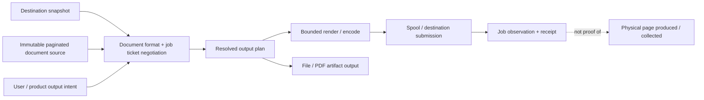

# Printing and document-output foundations vertical slice

| Field | Value |
|---|---|
| Status | Draft domain analysis |
| Purpose | Negotiate and submit immutable paginated documents to physical or virtual destinations with truthful lifecycle and output evidence |

## Conclusions

- A destination, queue, device, document format, job, document, sheet, side/impression, page, and output artifact are distinct entities.
- Destination capabilities are revisioned and document-format-sensitive. A ticket is resolved against an exact snapshot and revalidated at submission.
- The portable document source is immutable, paginated semantic page output with declared media boxes, color, resources, and determinism—not an invented universal printer graphics API.
- Rendering/encoding, spooling, destination acceptance, processing, completion, physical marking, and user collection are separate milestones.
- Print UI, silent submission, queue administration, secure release, accounting, scanning/fax, and file export require distinct authority and policy.

## Documents

- [Destination discovery and capability snapshots](destination-discovery.md)
- [Document source and representations](document-source.md)
- [Job ticket negotiation](job-ticket.md)
- [Job lifecycle and evidence](job-lifecycle.md)
- [Rendering, pagination, and color](rendering-color.md)
- [Artifact and virtual destinations](artifact-output.md)
- [Security, privacy, and accessibility](security-accessibility.md)
- [Platform research](platform-research.md)
- [Conformance](conformance.md)
- [Benchmarks](benchmarks.md)
