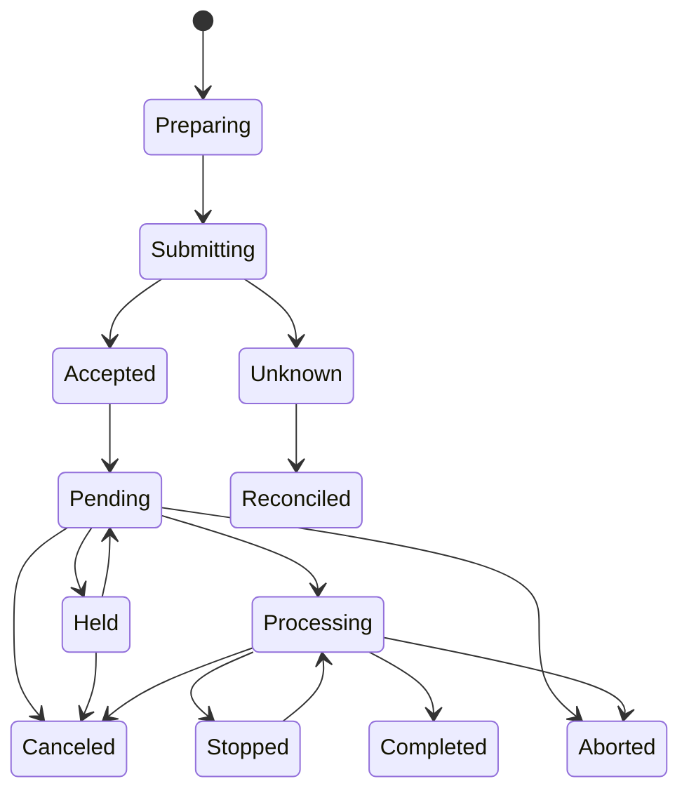

# Job lifecycle and evidence

`rm.print.submit` consumes a resolved plan and document source under explicit authority. It returns an owned generation-scoped job observation resource where the provider exposes one.

**RM-PRINT-JOB-0001:** Job identity MUST include provider, destination generation, provider-local identifier and generation/correlation evidence sufficient to reject identifier reuse.

**RM-PRINT-JOB-0002:** Local render complete, bytes transferred, spool accepted, destination accepted, pending, held, processing, stopped, canceled, aborted, provider-completed, impressions/sheets reported, and artifact durable are distinct milestones.

**RM-PRINT-JOB-0003:** Every state observation carries revision, time/clock quality, reasons with provenance, progress unit, estimated/actual distinction, and unknown/lost state. Native reasons are preserved as namespaced extensions.

**RM-PRINT-JOB-0004:** Cancellation is a request. It reports whether local production stopped, pending bytes were discarded, the spooler accepted cancellation, and the final observed state; already produced output cannot be recalled.

**RM-PRINT-JOB-0005:** Ambiguous submission, connection loss, provider restart, job disappearance, retention expiry, or insufficient observation authority yields `unknown` with reconciliation evidence, never fabricated success or safe automatic resubmission.

**RM-PRINT-JOB-0006:** Retry/resubmission requires explicit duplicate policy and a new attempt identity linked to the original. Exactly-once physical output is not claimed.

**RM-PRINT-JOB-0007:** Provider completion MUST NOT be described as proof of physical marking, correct finishing, output-bin arrival, user collection, confidentiality, or semantic fidelity unless a separately defined attestation proves that boundary.

See [ADR-0065](../../adr/0065-print-completion-is-boundary-scoped-evidence.md).
