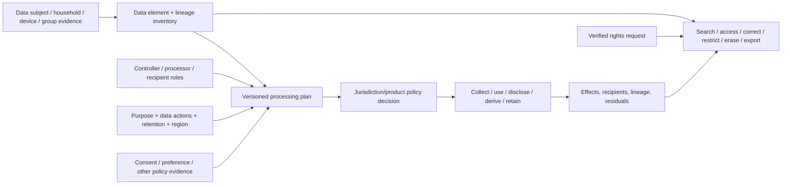

# Privacy engineering, purpose, consent, personal-data lifecycle, and data-rights foundations

| Field | Value |
|---|---|
| Status | Draft domain analysis |
| Purpose | Bind data processing to explicit subjects, purposes, roles, grants, lineage, and rights workflows without encoding jurisdiction-specific legal conclusions |

## Conclusions

- Possession, account relationship, a label, a permission prompt, or consent alone does not establish universal authority to process personal data.
- Consent is a versioned, purpose- and action-scoped, revocable grant with presentation and choice evidence; products may also use other counsel-approved policy bases outside the portable layer.
- Data processing plans name subjects, data categories/elements, purposes, actions, recipients, regions, retention, derived uses, models, and providers before effects.
- Rights requests are identity- and scope-verified workflows over authoritative lineage; access, correction, restriction, objection, portability, and erasure have different semantics.
- Erasure completion is boundary-scoped reconciliation across live data, derivatives, indexes, caches, replicas, recipients, logs, backups, models, holds, and residuals—not proof of universal disappearance.

## Documents

- [Model, roles, and milestones](model.md)
- [Personal-data subjects, identity, and linkage](subjects-identity.md)
- [Purposes, processing plans, and policy evidence](purpose-processing.md)
- [Consent, preferences, and withdrawal](consent-preferences.md)
- [Collection, minimization, and use limitation](minimization-use.md)
- [Lineage, derivation, and secondary use](lineage-secondary-use.md)
- [Residency, transfers, recipients, and processors](transfers-processors.md)
- [Retention, restriction, holds, and erasure](retention-erasure.md)
- [Rights requests and case workflow](rights-requests.md)
- [Access, export, correction, and portability](access-export-correction.md)
- [Deidentification and reidentification risk](deidentification.md)
- [Models, analytics, logs, and backups](derived-systems.md)
- [Platform and standards research](platform-research.md)
- [Cross-cutting qualities](cross-cutting.md)
- [Conformance](conformance.md)
- [Benchmarks](benchmarks.md)

## Decisions

- [ADR-0124: Consent is a revocable purpose-scoped grant, not universal processing authority](../../adr/0124-consent-is-a-revocable-purpose-scoped-grant.md)
- [ADR-0125: Erasure is a scoped lineage-reconciliation workflow](../../adr/0125-erasure-is-a-scoped-lineage-reconciliation-workflow.md)

## Boundary

This domain supplies neutral mechanisms and evidence for product privacy policy. It does not determine whether data is legally personal, select a lawful basis, interpret statutes/contracts, decide jurisdiction, define notices, replace counsel, adjudicate exemptions/holds, or guarantee compliance. Products bind those decisions through reviewed RFCs and policy artifacts.
