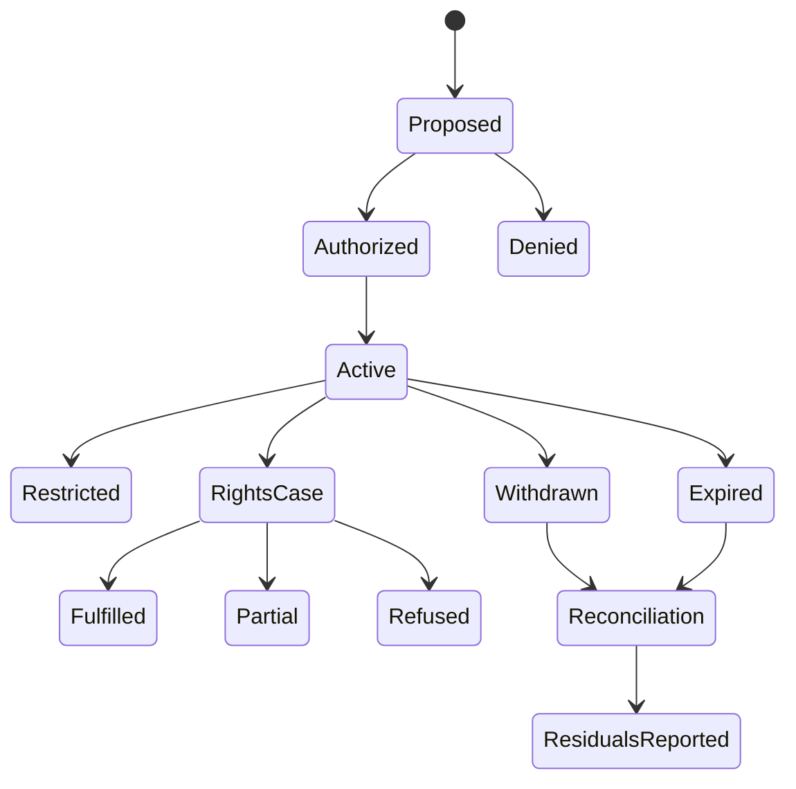

# Model, roles, and milestones

**RM-PRIVACY-MODEL-0001:** A privacy context binds product/tenant, data subject or related entity evidence, controller/business/processor/service-provider/recipient roles as product policy defines them, jurisdiction and policy generations, purpose, data actions, authority evidence, and time.

**RM-PRIVACY-MODEL-0002:** A data descriptor binds stable element/category/schema identity, subject/linkability class, source, accuracy/provenance, classification, sensitivity, purpose set, recipients, regions, retention, lineage, storage locations, protection, and authoritative owner.

**RM-PRIVACY-MODEL-0003:** Proposed, disclosed/noticed, choice presented, grant recorded, collection initiated, received, validated, stored, used, derived, disclosed/transferred, recipient accepted, retained, restricted, deleted, tombstoned, physically reclaimed, backup expired, and residual reconciled are distinct milestones.

**RM-PRIVACY-MODEL-0004:** Outcomes distinguish authorized/denied/unknown/deferred, consented/withdrawn/not-required-by-selected-policy/not-applicable, fulfilled/partially fulfilled/refused/exempted/identity-insufficient, live/deleted/restricted/held/residual, stale/conflicting, unsupported, failed, cancelled, and indeterminate.

**RM-PRIVACY-MODEL-0005:** Every processing result binds plan and policy generations, actor, subject/data scope, purpose/action, provider/location/recipient, input/output generations, start/finish, effect boundary, lineage updates, obligations, residuals, and nonclaims.

**RM-PRIVACY-MODEL-0006:** Legal-policy conclusions are opaque signed/versioned inputs with issuer, jurisdiction, scope, validity, review, and explanation references; portable code does not synthesize legal truth from geography, age, consent, or data type.

